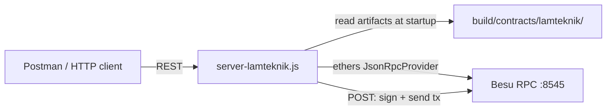

# LamTeknik Blockchain API Guide

How the REST API is structured and how to test it with Postman.

For smart contract compile/deploy, see [how-to-smart-contract.md](./how-to-smart-contract.md).

## Prerequisites

- Node.js >= 22.10
- Besu IBFT Node-1 running on `http://localhost:8545`
- Contracts deployed (`npm run deploy:lamteknik`) so `build/contracts/lamteknik/` exists
- `API/.env` configured (copy from `.env.example`)

---

## API structure

```
API/
├── server-lamteknik.js           # Express server — single entry point
├── build/contracts/lamteknik/    # Runtime artifacts loaded at startup (ABI + address)
├── postman/
│   ├── LamTeknik.postman_collection.json
│   └── LamTeknik.postman_environment.json
└── .env                          # Port, RPC URL, chain ID, default signer
```

### Runtime flow



On startup, `server-lamteknik.js`:

1. Connects to Besu via `BLOCKCHAIN_RPC_URL` / `BESU_RPC_URL` (default `http://localhost:8545`).
2. Reads every `*.json` in `build/contracts/lamteknik/` (skips `ContractRegistry.json`).
3. Builds an ethers contract instance per entity from the artifact ABI and on-chain address.
4. Mounts REST routes automatically — no manual route registration per entity.

If artifacts are missing or Besu is unreachable, the server still starts but entity routes will not be available. Check `GET /health` for `contractsLoaded`.

### Route layout

All entity routes live under `/lamteknik/<entity-slug>/...`. The slug is derived from the contract name:

| Contract | Entity slug | Base path |
|---|---|---|
| `AkreditasiStorage` | `akreditasi` | `/lamteknik/akreditasi` |
| `AsesmenKecukupanStorage` | `asesmen-kecukupan` | `/lamteknik/asesmen-kecukupan` |
| `KlasterIlmuStorage` | `klaster-ilmu` | `/lamteknik/klaster-ilmu` |

**Diagnostic routes** (not tied to a single entity):

| Method | Path | Purpose |
|---|---|---|
| `GET` | `/health` | Besu connectivity, block number, contracts loaded |
| `GET` | `/lamteknik` | List all loaded entities with addresses |
| `GET` | `/contracts` | Slug → contract name, registry key, address map |

**Entity routes** (same pattern for every entity):

| Method | Path | Smart contract call |
|---|---|---|
| `GET` | `/lamteknik/<entity>` | `retrieve()` |
| `GET` | `/lamteknik/<entity>/count` | `getTotal<Entity>()` |
| `GET` | `/lamteknik/<entity>/ids` | `getAll<Entity>Ids()` |
| `GET` | `/lamteknik/<entity>/index/:i` | `get<Entity>IdByIndex(i)` |
| `GET` | `/lamteknik/<entity>/:recordId` | `get<Entity>(recordId)` |
| `GET` | `/lamteknik/<entity>/:recordId/metadata` | `get<Entity>Metadata(recordId)` |
| `GET` | `/lamteknik/<entity>/:recordId/exists` | `does<Entity>Exist(recordId)` |
| `POST` | `/lamteknik/<entity>` | `store<Entity>(...)` |

Static path segments (`count`, `ids`, `index`) are registered before `/:recordId` so they are not captured as record IDs.

### Read vs write

- **GET requests** are read-only. The server calls view functions on Besu via the JSON-RPC provider. No private key is needed.
- **POST requests** submit a transaction. The server signs with either:
  - `privateKey` in the request body, or
  - `DEPLOYER_PRIVATE_KEY` / `DEFAULT_PRIVATE_KEY` from `API/.env` when no key is provided.

### POST body (CDC envelope)

```json
{
  "recordId": "42",
  "createdTimestamp": 1745000000,
  "modifiedTimestamp": 1745000600,
  "modifiedBy": "debezium@cdc",
  "allData": "{\"id\":42,\"kodeAkreditasi\":\"AKR-001\"}"
}
```

`allData` must be a **JSON string** (the full row payload), not a nested object.

Successful POST response:

```json
{
  "success": true,
  "entity": "akreditasi",
  "contractName": "AkreditasiStorage",
  "registryKey": "LamTeknik:AkreditasiStorage",
  "contractAddress": "0x...",
  "recordId": "42",
  "transactionHash": "0x...",
  "blockNumber": 1234
}
```

All responses include `"success": true|false`. Errors return HTTP 4xx/5xx with an `"error"` message.

### Environment variables

| Variable | Default | Used by |
|---|---|---|
| `LAMTEKNIK_PORT` | `4100` | HTTP listen port |
| `BESU_RPC_URL` / `BLOCKCHAIN_RPC_URL` | `http://localhost:8545` | Besu connection |
| `BESU_CHAIN_ID` / `CHAIN_ID` | `1337` | Chain ID + artifact lookup |
| `DEPLOYER_PRIVATE_KEY` / `DEFAULT_PRIVATE_KEY` | — | Default transaction signer |
| `CORS_ORIGIN` | `*` | Allowed browser origins |

---

## Start the API

```bash
cd API
npm install          # first time only
npm run deploy:lamteknik   # if contracts not yet deployed
npm run dev          # nodemon — http://localhost:4100
# or
npm run start        # plain node
```

Quick check from the terminal:

```bash
curl http://localhost:4100/health
```

Expected: `"status": "healthy"` and `"contractsLoaded": 26`.

---

## Test with Postman

Postman files are in `API/postman/`:

- `LamTeknik.postman_collection.json` — 11 requests (3 diagnostics + 8 entity-templated)
- `LamTeknik.postman_environment.json` — local environment variables

### 1. Import collection and environment

1. Open Postman → **File** → **Import**.
2. Drag both JSON files from `API/postman/`.
3. Top-right environment switcher → select **LamTeknik (local)**.

### 2. Confirm the server is running

Run **Diagnostics → GET /health**.

Expected response:

```json
{
  "success": true,
  "status": "healthy",
  "chainId": 1337,
  "rpcUrl": "http://localhost:8545",
  "blockNumber": 7224,
  "contractsLoaded": 26,
  "hasDefaultSigner": true
}
```

If `contractsLoaded` is `0`, deploy contracts first (`npm run deploy:lamteknik`) and restart the server.

### 3. Explore loaded entities

Run **Diagnostics → GET /lamteknik (list entities)**.

This returns every entity slug, contract name, registry key, and on-chain address. Use it to confirm which slugs are available before testing entity routes.

### 4. Test read endpoints

Set the `entity` environment variable (default: `akreditasi`), then run requests under **Entity (templated by {{entity}})**:

1. **GET /lamteknik/{{entity}} (retrieve)** — total count and all IDs
2. **GET /lamteknik/{{entity}}/count** — record count only
3. **GET /lamteknik/{{entity}}/ids** — all record IDs

To test a specific record, set `recordId` in the environment (default: `42`), then run:

4. **GET /lamteknik/{{entity}}/{{recordId}}/exists** — check if the record exists
5. **GET /lamteknik/{{entity}}/{{recordId}}** — full row (returns error if not found)
6. **GET /lamteknik/{{entity}}/{{recordId}}/metadata** — envelope fields without `allData`

Switch `entity` to test a different contract — the same 8 requests work for all entities.

### 5. Test write endpoint (store)

1. Set environment variables:

   | Variable | Example | Notes |
   |---|---|---|
   | `entity` | `akreditasi` | Target contract |
   | `recordId` | `42` | Unique record key |
   | `createdTimestamp` | `1745000000` | Unix seconds |
   | `modifiedTimestamp` | `1745000600` | Unix seconds |
   | `modifiedBy` | `debezium@cdc` | Source identifier |
   | `allData` | `{"id":42,"kodeAkreditasi":"AKR-001"}` | Plain JSON — collection script stringifies it |
   | `privateKey` | *(empty)* | Server uses `.env` default signer |

2. Run **POST /lamteknik/{{entity}} (store)**.

3. On success, the collection saves `transactionHash` to the `txHash` collection variable.

4. Verify the write with **GET /lamteknik/{{entity}}/{{recordId}}** — the stored `allData` should match.

Re-run POST with the same `recordId` to test an update (modified timestamp changes, record is not duplicated).

### Valid entity slugs

```
akreditasi, asesmen-kecukupan, asesmen-lapangan, asesor, bank,
institusi, jenjang, keputusan-ma, klaster-ilmu, klaster-prodi,
klaster-profesi, komite-evaluasi, laporan-asesmen, majelis-akreditasi,
pembayaran, penawaran-asesor, pengesahan-ak, pengesahan-al, prodi,
provinsi, respon-asesor, sekretariat, tenant, upps, user, validator
```

### Postman collection behavior

The collection includes a pre-request script that:

- Wraps `allData` with `JSON.stringify` so the server receives a JSON-escaped string.
- Strips an empty `privateKey` from POST bodies so the server falls back to `API/.env`.

Each request includes basic test scripts (`status 200`, `success: true`).

### Troubleshooting

| Symptom | Likely cause | Fix |
|---|---|---|
| `contractsLoaded: 0` | Artifacts missing | `npm run deploy:lamteknik`, restart server |
| `status: unhealthy` | Besu not running | Start Node-1 per `backend/blockchain-besu-ibft/command/run-besu-ibft.md` |
| `Unknown LamTeknik entity` | Wrong `entity` slug | Use kebab-case slug from the list above |
| POST `No signing key available` | No key in body or `.env` | Set `DEPLOYER_PRIVATE_KEY` in `API/.env` |
| GET record returns 500 | Record does not exist yet | POST first, or check `/exists` |
| Connection refused on `:4100` | Server not started | `npm run dev` in `API/` |
