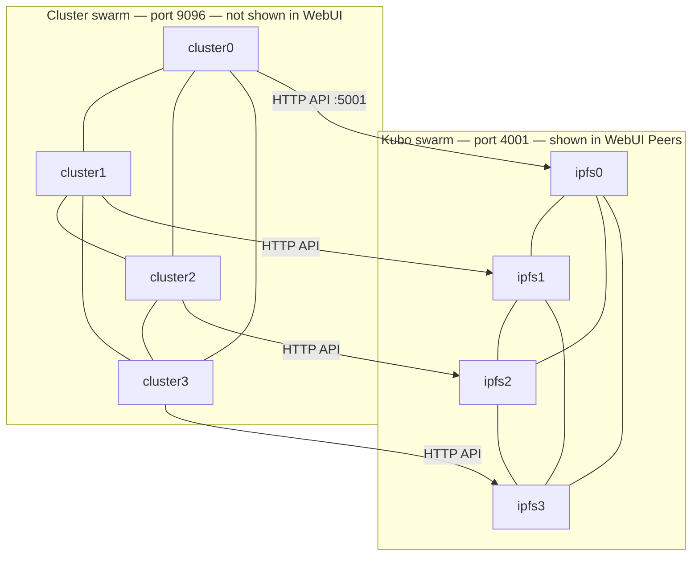

# Private IPFS Cluster — Run Guide

How the private IPFS Cluster stack is structured and how to start it on a fresh machine.

---

## Architecture overview

This stack runs **4 Kubo (IPFS) nodes** and **4 IPFS Cluster nodes** on a single Docker Compose network. Nodes are isolated from the public IPFS network using a shared pre-shared key (`swarm.key`).

### Directory layout

```
backend/ipfs-cluster-private/
├── docker-compose.yml          # 4× Kubo + 4× cluster services
├── swarm.key                   # Private network PSK (generated locally, not in git)
├── .env                        # CLUSTER_SECRET (generated locally, not in git)
├── assets/
│   └── webui-v4.12.0.car       # WebUI bundle for offline use (downloaded, not in git)
├── scripts/
│   ├── generate-swarm-key.sh   # Create swarm.key
│   ├── download-webui-car.sh   # Download WebUI CAR from GitHub
│   ├── 010-private-network.sh  # Disable public discovery, set private bootstrap peers
│   └── 020-import-webui.sh     # Import + pin WebUI on ipfs0 (runs before daemon)
└── compose/                    # Persistent node data (Kubo repos + cluster state)
    ├── ipfs0/ … ipfs3/
    └── cluster0/ … cluster3/
```

### Two peer layers

Kubo and IPFS Cluster use **separate libp2p networks**. The Kubo WebUI Peers page only shows the Kubo layer.



| Layer | Containers | Port | Role |
|---|---|---|---|
| **Kubo (IPFS)** | `ipfs0`–`ipfs3` | 4001 (swarm), 5001 (API) | Store and exchange IPFS blocks on a private swarm |
| **IPFS Cluster** | `cluster0`–`cluster3` | 9096 (swarm), 9094 (API) | Pinset orchestration across the 4 Kubo nodes |

Each **Cluster PEER N** is a pair: `ipfsN` (storage) + `clusterN` (orchestration).

### How privacy is enforced

On every Kubo container start, `010-private-network.sh` runs **before** the daemon:

1. **`swarm.key`** — shared PSK; only nodes with the same key can connect.
2. **`LIBP2P_FORCE_PNET=1`** — daemon refuses to start without a private network key.
3. **Public discovery disabled** — AutoConf, MDNS, public bootstrap, and delegated routers are turned off.
4. **Private bootstrap peers** — each `ipfsN` bootstraps only to the other compose Kubo nodes via Docker DNS (`PRIVATE_BOOTSTRAP_PEERS` in `docker-compose.yml`).

Cluster peers join via `CLUSTER_SECRET` (CRDT mode). `cluster1`–`cluster3` bootstrap to `cluster0` on first start.

### WebUI on a private network

Kubo does not bundle WebUI. Without local blocks, `http://127.0.0.1:5001/webui` hangs on a private network.

`ipfs0` runs `020-import-webui.sh`, which imports `assets/webui-v4.12.0.car` and pins WebUI v4.12.0 (`bafybeihxglpcfyarpm7apn7xpezbuoqgk3l5chyk7w4gvrjwk45rqohlmm`) before the daemon starts.

### Host ports (ipfs0 / cluster0)

| Port | Service | Binding |
|---|---|---|
| 5001 | Kubo API + WebUI | `127.0.0.1` only |
| 8080 | Kubo gateway | `127.0.0.1` only |
| 9094 | Cluster REST API | `127.0.0.1` only |
| 9095 | Cluster IPFS proxy | all interfaces |
| 9096 | Cluster swarm | all interfaces |

Swarm port 4001 is **not** exposed to the host; Kubo peers talk over the internal Docker network only.

### WebUI peer count note

With 4 Kubo nodes, viewing WebUI on `ipfs0` shows **3 unique peers** (ipfs1, ipfs2, ipfs3). The list may show **more than 3 rows** because libp2p can display multiple connections (different TCP ports/transports) to the same peer. Use the CLI to count unique peer IDs (see Verification below).

---

## Run on a fresh machine

### Prerequisites

- [Docker Desktop](https://www.docker.com/products/docker-desktop/) (or Docker Engine + Compose v2)
- Internet access for the **first-time** image pull and WebUI CAR download
- Git (to clone the repository)

Optional for script helpers:

- Git Bash or WSL (for `scripts/*.sh`)
- OpenSSL (for key generation), or use the PowerShell alternatives below

### Step 1 — Clone and enter the directory

```powershell
git clone <repository-url>
cd backend/ipfs-cluster-private
```

### Step 2 — Generate secrets

**Swarm key** (same key on all Kubo nodes):

```powershell
# Git Bash / WSL
sh scripts/generate-swarm-key.sh

# PowerShell alternative
$bytes = New-Object byte[] 32
[System.Security.Cryptography.RandomNumberGenerator]::Create().GetBytes($bytes)
$key = [BitConverter]::ToString($bytes).Replace('-','').ToLower()
@("/key/swarm/psk/1.0.0/","/base16/",$key) | Set-Content swarm.key
```

**Cluster secret** (same value for all cluster nodes):

```powershell
# PowerShell
$secret = -join ((1..32) | ForEach-Object { '{0:x2}' -f (Get-Random -Maximum 256) })
"CLUSTER_SECRET=$secret" | Set-Content .env

# OpenSSL alternative
# echo "CLUSTER_SECRET=$(openssl rand -hex 32)" > .env
```

Copy from `.env.example` if you prefer to edit manually.

### Step 3 — Download WebUI CAR

Required so WebUI loads without the public IPFS network.

```powershell
# Git Bash / WSL
sh scripts/download-webui-car.sh

# PowerShell / curl
New-Item -ItemType Directory -Force -Path assets | Out-Null
curl.exe -fsSL -o assets/webui-v4.12.0.car `
  "https://github.com/ipfs/ipfs-webui/releases/download/v4.12.0/ipfs-webui%40v4.12.0.car"
```

### Step 4 — Start the stack

```powershell
docker compose up -d
```

Wait ~30 seconds for all containers to become healthy:

```powershell
docker ps --filter "name=ipfs" --filter "name=cluster"
```

### Step 5 — First-time bootstrap (new `compose/` data only)

`docker-compose.yml` embeds **Kubo peer IDs** and **cluster0's cluster peer ID** from the environment where the stack was first initialized. If `compose/` is empty (true fresh install), Docker creates **new** identities on first start — the hardcoded IDs in compose will not match until you update them.

**Skip this step** if you copied an existing `compose/` directory from another machine (same peer IDs).

1. Collect Kubo peer IDs:

```powershell
docker exec ipfs0 ipfs id -f "<id>`n"
docker exec ipfs1 ipfs id -f "<id>`n"
docker exec ipfs2 ipfs id -f "<id>`n"
docker exec ipfs3 ipfs id -f "<id>`n"
```

2. Collect cluster0 peer ID (for `cluster1`–`cluster3` bootstrap):

```powershell
docker exec cluster0 ipfs-cluster-ctl id -f "<id>`n"
```

3. Update `docker-compose.yml`:
   - Set each `ipfsN` service's `PRIVATE_BOOTSTRAP_PEERS` to the **other three** Kubo multiaddrs:
     `/dns4/ipfs<M>/tcp/4001/p2p/<PeerID>`
   - Set `cluster1`–`cluster3` `command` bootstrap address to:
     `/dns4/cluster0/tcp/9096/p2p/<cluster0_PeerID>`

4. Recreate Kubo and cluster nodes so init scripts re-run:

```powershell
docker compose up -d --force-recreate ipfs0 ipfs1 ipfs2 ipfs3 cluster1 cluster2 cluster3
```

---

## Verification

### Kubo — private swarm (from ipfs0)

```powershell
# Connected peers (may be more lines than unique peers)
docker exec ipfs0 ipfs swarm peers

# Unique peer count — expect 3 on a 4-node cluster viewed from ipfs0
docker exec ipfs0 ipfs swarm peers | ForEach-Object {
  if ($_ -match '/p2p/(\S+)') { $matches[1] }
} | Sort-Object -Unique

# Bootstrap list — only /dns4/ipfs1|2|3/..., no bootstrap.libp2p.io
docker exec ipfs0 ipfs bootstrap list

# Private network confirmed in logs
docker logs ipfs0 2>&1 | Select-String "private network"
```

### WebUI

Open **http://127.0.0.1:5001/webui**

- Page loads (no infinite spinner)
- Peers tab shows **Local Network** only, no public **Unknown** peers
- Expect **3 unique Kubo peers** from ipfs0 (possibly more rows due to duplicate connections)

```powershell
docker exec ipfs0 ipfs dag stat bafybeihxglpcfyarpm7apn7xpezbuoqgk3l5chyk7w4gvrjwk45rqohlmm --offline
```

### IPFS Cluster

```powershell
docker exec cluster0 ipfs-cluster-ctl peers ls
```

Expect **4 cluster peers**, each seeing 3 others.

---

## Day-to-day commands

```powershell
# Start
docker compose up -d

# Stop
docker compose down

# Logs
docker logs -f ipfs0
docker logs -f cluster0

# Add a file via ipfs0
docker exec ipfs0 ipfs add /path/inside/container
```

---

## Troubleshooting

| Problem | Likely cause | Fix |
|---|---|---|
| WebUI blank / spinning | WebUI CAR missing | Run Step 3, restart `ipfs0` |
| `swarm.key not found` | Key not generated | Run Step 2 |
| Kubo nodes don't peer | Stale peer IDs in compose | Run Step 5 |
| `CLUSTER_SECRET` warning | `.env` missing | Create `.env` with `CLUSTER_SECRET` |
| Cluster peers don't join | Mismatched secret or cluster0 ID | Same `CLUSTER_SECRET` on all nodes; update cluster bootstrap ID |

To fully reset and reinitialize (destroys pinned data):

```powershell
docker compose down
Remove-Item -Recurse -Force compose/
# Re-run Steps 2–5
docker compose up -d
```
