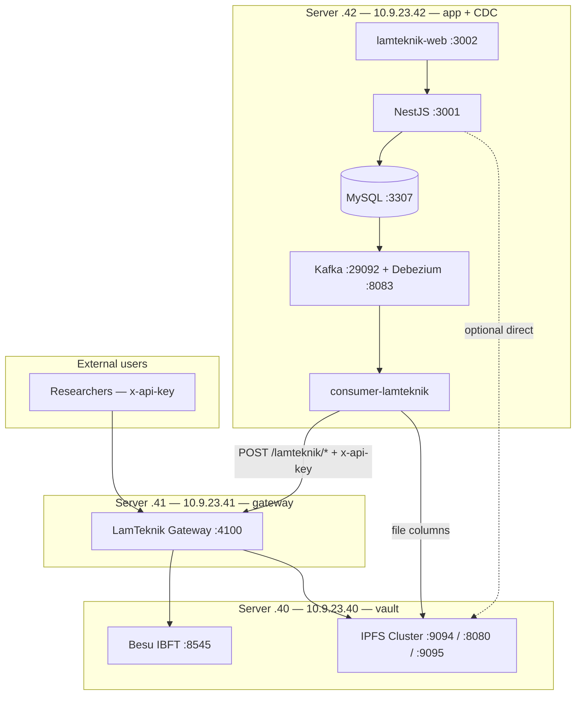

# LamTeknik Infrastructure

Target deployment layout: **blockchain + IPFS on server `.40`**, **API gateway on server `.41`**, **app + CDC on server `.42`**. All production work runs on VMs — not local Docker.

**VM runbooks:** [vm-40-node-vault-plan.md](./vm-40-node-vault-plan.md) · [vm-41-gateway-plan.md](./vm-41-gateway-plan.md)

**Related:** [revamp-system-plan.md](./revamp-system-plan.md) · [project-overview.md](./project-overview.md)

---

## Design principles

| Principle | Meaning |
|-----------|---------|
| **Vault vs front door** | VM `.40` runs nodes only. Users never get raw Besu/IPFS ports. |
| **Express BAF gateway** | Researchers use one base URL + `x-api-key` on the LamTeknik Gateway (`.41`). Application-level access control — not raw JSON-RPC. |
| **CDC with app** | Kafka, Debezium, and `consumer-lamteknik` always live on the **same machine as MySQL** — server `.42`. |
| **Gateway on `.41` only** | Server `.41` runs the LamTeknik Gateway container only — not the LamTeknik app stack, not Kong. |
| **VM-only deployment** | Implement Besu, IPFS, gateway, and CDC on VMs — local stack is dev reference only. |
| **SSH for ops** | Node management, key CRUD, ufw, and pin recovery via SSH — no public admin UI. |
| **No FireFly / No Kong** | FireFly dropped (poor CDC fit). Kong dropped (overkill for Besu-only entity REST). |

---

## Topology

### Production layout — 3 VMs

| Host | IP / location | Role | Public internet |
|------|---------------|------|-----------------|
| **Node vault** | `10.9.23.40` | Besu IBFT + IPFS Cluster | **No** — ufw allows trusted IPs only |
| **Gateway** | `10.9.23.41` | LamTeknik Gateway (Express BAF) | Gateway `:4100` (or `:443` via optional Caddy) |
| **App + CDC** | `10.9.23.42` | MySQL, NestJS, lamteknik-web, Kafka, Debezium, consumer | Private network only |



## Repository components by host

| Repo path | Server `.40` | Server `.41` | Server `.42` |
|-----------|--------------|--------------|--------------|
| [`backend/blockchain-besu-ibft/`](../backend/blockchain-besu-ibft/) | ✓ | | |
| [`backend/ipfs-cluster-private/`](../backend/ipfs-cluster-private/) | ✓ | | |
| [`API/`](../API/) (LamTeknik Gateway) | | ✓ | |
| [`connection/kafka-debezium/`](../connection/kafka-debezium/) | | | ✓ |
| [`connection/consumer-lamteknik/`](../connection/consumer-lamteknik/) | | | ✓ |
| [`target/`](../target/) (MySQL + NestJS) | | | ✓ |
| [`frontend/lamteknik-web/`](../frontend/lamteknik-web/) | | | ✓ |

Smart contracts (`API/contracts/*Storage.sol`) deploy to Besu on `.40`. The gateway on `.41` loads deployment artifacts from `API/build/contracts/lamteknik/`.

---

## Port matrix

### VM `.40` — node vault

| Port | Service | Docker compose | Exposed to host | Allowed callers |
|------|---------|----------------|-----------------|-----------------|
| 8545 | Besu RPC (node-1) | `blockchain-besu-ibft/docker` | All interfaces *(ufw restricts)* | `.41`, app VM |
| 8546–8548 | Besu RPC nodes 2–4 | same | All interfaces | Internal / ops |
| 8081 | Chainlens explorer | same | All interfaces | Ops only *(optional)* |
| 5001 | Kubo API + WebUI | `ipfs-cluster-private` | **127.0.0.1 only** | SSH tunnel for ops |
| 8080 | IPFS gateway | same | **Must expose to LAN** *(see revamp plan)* | `.41`, app VM |
| 9094 | IPFS Cluster REST | same | **Must expose to LAN** | `.41`, `.42` (CDC files) |
| 9095 | Cluster IPFS proxy | same | All interfaces | `.42` (NestJS `/api/v0/*`) |
| 9096 | Cluster swarm | same | All interfaces | Cluster peers only |
| 4001 | Kubo swarm | same | Not on host | Internal Docker network |

### VM `.41` — gateway

| Port | Service | Notes |
|------|---------|-------|
| 4100 | LamTeknik Gateway | Blockchain REST + IPFS proxy; CDC and researchers call this |
| 443 / 80 | HTTPS reverse proxy *(optional)* | Caddy/nginx → `:4100` direct — no Kong layer |

Key management: edit [`API/keys.json`](../API/keys.json) via SSH, restart gateway container.

### Local machine — dev reference only

Local Docker stack remains for development. Production CDC and gateway run on VMs `.40`–`.42`.

| Port | Service | Notes |
|------|---------|-------|
| 3307 | MySQL `lamtek_db` | CDC source; binlog ROW format |
| 6379 | Redis | NestJS cache |
| 3001 | NestJS API | lamteknik-web backend |
| 3002 | lamteknik-web | Frontend |
| 29092 | Kafka bootstrap | Consumer connects locally |
| 8083 | Debezium Connect REST | Connector registration |
| 8085 | Kafka UI | Debugging |

**Outbound (`.42` → servers):**

| Target | URL | Used by |
|--------|-----|---------|
| Gateway | `http://10.9.23.41:4100` | Consumer blockchain writes |
| IPFS Cluster | `http://10.9.23.40:9094` | Consumer file columns |
| IPFS gateway | `http://10.9.23.40:8080` | NestJS file reads *(optional)* |
| IPFS proxy | `http://10.9.23.40:9095` | NestJS uploads *(optional)* |

NestJS should **not** call Besu `:8545` directly unless `.40` ufw allows the caller — prefer gateway for chain reads/writes from app code.

## Network and firewall

### VM `.40` — node vault

**Default:** deny all incoming. Allow gateway and app VM.

```bash
sudo ufw default deny incoming
sudo ufw default allow outgoing

# Admin SSH (adjust subnet)
sudo ufw allow from 10.9.23.0/24 to any port 22

# Gateway VM — always
sudo ufw allow from 10.9.23.41 to any port 8545
sudo ufw allow from 10.9.23.41 to any port 9094
sudo ufw allow from 10.9.23.41 to any port 8080

# App + CDC VM
sudo ufw allow from 10.9.23.42 to any port 9094
sudo ufw allow from 10.9.23.42 to any port 8080
sudo ufw allow from 10.9.23.42 to any port 9095

sudo ufw enable
```

**Do not** open `.40` to `0.0.0.0/0` without ufw.

### VM `.41` — gateway

```bash
sudo ufw default deny incoming
sudo ufw default allow outgoing
sudo ufw allow from 10.9.23.0/24 to any port 22
sudo ufw allow from 10.9.23.42 to any port 4100   # CDC
sudo ufw allow from <RESEARCHER_NETWORK> to any port 4100
# Optional: sudo ufw allow 443/tcp
sudo ufw enable
```

Gateway talks **outbound** to `.40` — ensure `.40` ufw allows `.41` as above.

---

## Traffic flows

### Researchers / external API users

```
x-api-key  →  Gateway .41:4100  →  Besu .40:8545  (contract reads/writes)
                                →  IPFS .40:9094 / :8080  (upload / download via proxy)
```

Example profile handed to a user:

```
Base URL:   http://10.9.23.41:4100
API key:    sk-lamtek-research-xxxx
Entities:   akreditasi, user, prodi, …

Read:   GET  /lamteknik/akreditasi/count
Write:  POST /lamteknik/akreditasi
IPFS:   POST /ipfs/upload   GET /ipfs/{cid}
```

Researchers **never** receive `10.9.23.40` or raw node ports. No raw JSON-RPC passthrough on the gateway.

### CDC pipeline (VM `.42` → servers)

```
MySQL (.42 :3307)
  → Debezium (.42) → Kafka (.42) → consumer (.42)
       → file columns: IPFS Cluster  http://10.9.23.40:9094/add
       → entity rows:  Gateway         http://10.9.23.41:4100/lamteknik/{entity}
                            → Besu       http://10.9.23.40:8545
```

Consumer sends `x-api-key` with internal admin key. Gateway signs with `DEPLOYER_PRIVATE_KEY`.

### LamTeknik web app (VM `.42`)

```
lamteknik-web (.42 :3002) → NestJS (.42 :3001) → MySQL (.42)
NestJS → IPFS on .40 for dokumen uploads (9095 or 9094)
NestJS → gateway on .41 for chain ops (recommended)
```

### Operations / monitoring (SSH only)

| Tool | Access |
|------|--------|
| IPFS WebUI `:5001/webui` | SSH tunnel: `ssh -L 5001:127.0.0.1:5001 user@10.9.23.40` |
| Chainlens `:8081` | Restrict to admin network or SSH tunnel |
| Kafka UI `:8085` | App VM localhost or admin VPN |
| Gateway health | `GET http://10.9.23.41:4100/health` |
| API key admin | SSH to `.41` → edit `keys.json` → `docker compose restart` |

---

## Environment variables (cross-VM)

### Gateway on `.41` — [`API/.env`](../API/.env.example)

```env
LAMTEKNIK_PORT=4100
BLOCKCHAIN_RPC_URL=http://10.9.23.40:8545
CHAIN_ID=1337
DEPLOYER_PRIVATE_KEY=<server signer — not shared with researchers>
IPFS_CLUSTER_REST_URL=http://10.9.23.40:9094
IPFS_GATEWAY_URL=http://10.9.23.40:8080
CORS_ORIGIN=*
API_KEY_REQUIRED=true
API_KEYS_FILE=/app/keys.json
AUDIT_LOG_ENABLED=false
```

### Consumer on VM `.42` — [`connection/consumer-lamteknik/.env`](../connection/consumer-lamteknik/.env.example)

```env
API_ENDPOINT=http://10.9.23.41:4100
API_KEY=sk-lamtek-cdc-internal
IPFS_CLUSTER_REST_URL=http://10.9.23.40:9094
KAFKA_BROKER=127.0.0.1:29092
KAFKA_CONNECT_URL=http://127.0.0.1:8083
DB_HOST=127.0.0.1
DB_PORT=3307
```

### NestJS on VM `.42` — [`target/docker-compose.yml`](../target/docker-compose.yml)

```env
BESU_RPC_URL=http://10.9.23.41:4100/lamteknik   # via gateway (recommended)
IPFS_API_URL=http://10.9.23.40:9095
IPFS_GATEWAY_URL=http://10.9.23.40:8080
```

---

## Security model

| Actor | Auth | Reaches |
|-------|------|---------|
| Researcher | `x-api-key` via gateway | `/lamteknik/*`, `/ipfs/*` on `.41` only; entity scope via `allowedEntities` |
| CDC consumer | Internal admin `x-api-key` | Gateway `.41:4100`, IPFS `.40:9094` direct |
| Admin (deploy) | Admin `x-api-key` (`role: admin`) | Same as researcher + `POST /deploy/lamteknik` |
| NestJS app | JWT for app users; infra uses env URLs | MySQL local; Besu/IPFS via gateway or `.40` |
| Node ops | SSH only | Besu/IPFS/Kafka restarts, ufw, `keys.json` edits |
| Public internet | Blocked from `.40` | ufw on node vault |

**Signing:** Gateway holds `DEPLOYER_PRIVATE_KEY`. Signing queue serializes concurrent writes (CDC + researchers). Researchers never supply Besu private keys in POST bodies.

**Future Fabric:** add `"backend": "fabric"` per key in `keys.json` when a Fabric network exists — not implemented now.

---

## What we explicitly rejected

| Option | Reason |
|--------|--------|
| **Hyperledger FireFly** | No Bifrost-like admin UI; IPFS not in gateway mode; CDC route rewrite; high ops cost |
| **Kong OSS** | Overkill for Besu-only entity REST; Express handles `x-api-key` directly |
| **Expose Besu/IPFS to internet** | Unauthenticated RPC and cluster REST are unsafe |
| **Raw JSON-RPC passthrough** | No entity-level access control; security best practice is app-layer REST |
| **CDC on gateway VM separate from MySQL** | Cross-VM binlog complexity; CDC must follow app |
| **Public admin/ops routes on gateway** | Node management stays SSH-only |

---

## Startup order (3-VM layout)

| Order | Host | Component |
|-------|------|-----------|
| 1 | Server `.40` | Besu IBFT + IPFS Cluster (+ ufw + IPFS port bind fix) — [vm-40 plan](./vm-40-node-vault-plan.md) |
| 2 | Server `.40` or `.41` | Deploy contracts (`API/` Hardhat) if not yet deployed |
| 3 | Server `.41` | LamTeknik Gateway container — [vm-41 plan](./vm-41-gateway-plan.md) |
| 4 | Server `.42` | MySQL + NestJS (`target/docker compose up`) |
| 5 | Server `.42` | Kafka + Debezium (`connection/kafka-debezium/`) |
| 6 | Server `.42` | Register Debezium connector + start consumer |
| 7 | Server `.42` | lamteknik-web frontend |
| 8 | All | Integration tests (Phase 4 in revamp plan) |

---

## VM plan index

| VM | IP | Runbook |
|----|-----|---------|
| Node vault | `10.9.23.40` | [vm-40-node-vault-plan.md](./vm-40-node-vault-plan.md) |
| Gateway | `10.9.23.41` | [vm-41-gateway-plan.md](./vm-41-gateway-plan.md) |
| App + CDC | `10.9.23.42` | Phase 3 in [revamp-system-plan.md](./revamp-system-plan.md) *(dedicated runbook TBD)* |
