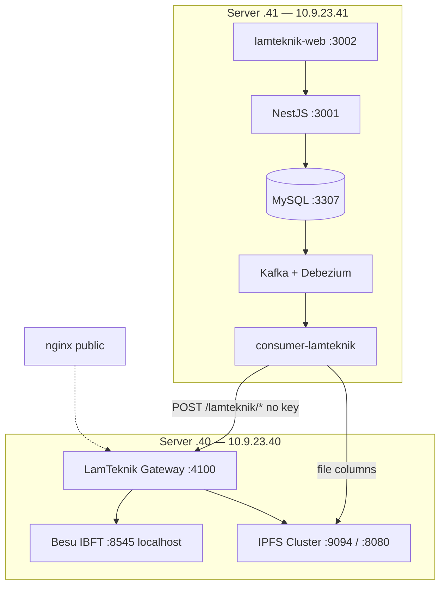

# LamTeknik Infrastructure

Target deployment layout: **blockchain + IPFS + API gateway on server `.40`**, **app + CDC on server `.41`**. Dev build — open API, no firewall rules on `.40`. Public API access via nginx (configured separately).

**Current runtime state (2026-09-23):** Besu on VM `.40` is intentionally turned off. The operator starts the selected blockchain network manually, one network at a time, before its tests.

**VM runbook:** [vm-40-node-vault-plan.md](./vm-40-node-vault-plan.md)

**Related:** [revamp-system-plan.md](./revamp-system-plan.md) · [project-overview.md](./project-overview.md)

---

## Design principles

| Principle | Meaning |
|-----------|---------|
| **Unified infra on `.40`** | Besu, IPFS Cluster, and LamTeknik Gateway run on one VM. Gateway reaches Besu and IPFS via `host.docker.internal`. |
| **Open dev API** | `API_KEY_REQUIRED=false` — apps call `:4100` without `x-api-key`. Gateway signs writes with `DEPLOYER_PRIVATE_KEY`. |
| **Operator-controlled blockchain** | The selected blockchain network is started manually for its test window; only one blockchain network runs at a time. Other supporting services may use `restart: unless-stopped`. |
| **Besu RPC localhost-only** | Raw JSON-RPC never exposed; apps use Express REST on `:4100`. |
| **CDC with app** | Kafka, Debezium, and `consumer-lamteknik` live on the **same machine as MySQL** — server `.41`. |
| **nginx external** | Public API exposure handled outside this repo (reverse proxy → `:4100`). |
| **No FireFly / No Kong** | Custom Express gateway only. |

---

## Topology — 2 VMs

| Host | IP | Role |
|------|-----|------|
| **Infra stack** | `10.9.23.40` | Besu IBFT + IPFS Cluster + LamTeknik Gateway |
| **App + CDC** | `10.9.23.41` | MySQL, NestJS, lamteknik-web, Kafka, Debezium, consumer |



---

## Repository components by host

| Repo path | Server `.40` | Server `.41` |
|-----------|--------------|--------------|
| [`blockchain/blockchain-besu-ibft/`](../blockchain/blockchain-besu-ibft/) | ✓ | |
| [`blockchain/ipfs-cluster-private/`](../blockchain/ipfs-cluster-private/) | ✓ | |
| [`blockchain-API/`](../blockchain-API/) (LamTeknik Gateway) | ✓ | |
| [`connection/kafka-debezium/`](../connection/kafka-debezium/) | | ✓ |
| [`connection/consumer-lamteknik/`](../connection/consumer-lamteknik/) | | ✓ |
| [`target/`](../target/) (MySQL + NestJS) | | ✓ |
| [`frontend/lamteknik-web/`](../frontend/lamteknik-web/) | | ✓ |

---

## Port matrix — VM `.40`

| Port | Service | Bind | Notes |
|------|---------|------|-------|
| 8545 | Besu RPC (node-1) | localhost | Gateway only |
| 8546–8548 | Besu RPC nodes 2–4 | all | Ops |
| 8081 | Chainlens explorer | all | Ops only |
| 4100 | LamTeknik Gateway | all | nginx proxies here |
| 9094 | IPFS Cluster REST | default | Gateway + `.41` consumer |
| 8080 | IPFS gateway | default | Reads |
| 9095 | Cluster IPFS proxy | default | NestJS uploads from `.41` |
| 5001 | Kubo API / WebUI | localhost | SSH tunnel |

---

## Port matrix — VM `.41` (local dev reference)

| Port | Service |
|------|---------|
| 3307 | MySQL `lamtek_db` |
| 6379 | Redis |
| 3001 | NestJS API |
| 3002 | lamteknik-web |
| 29092 | Kafka bootstrap |
| 8083 | Debezium Connect |
| 8085 | Kafka UI |

**Outbound (`.41` → `.40`):**

| Target | URL | Used by |
|--------|-----|---------|
| Gateway | `http://10.9.23.40:4100` | Consumer + NestJS blockchain |
| IPFS Cluster | `http://10.9.23.40:9094` | Consumer file columns |
| IPFS gateway | `http://10.9.23.40:8080` | NestJS file reads |

---

## Traffic flows

### Apps / CDC (no API key)

```
App or consumer  →  Gateway .40:4100  →  Besu localhost:8545
                                        →  IPFS localhost:9094 / :8080
```

Consumer file columns may also call IPFS direct on `.40:9094`.

### Environment variables

**Gateway on `.40` — [`blockchain-API/.env`](../blockchain-API/.env.example):**

```env
LAMTEKNIK_PORT=4100
BLOCKCHAIN_RPC_URL=http://127.0.0.1:8545
BESU_RPC_URL=http://127.0.0.1:8545
IPFS_CLUSTER_REST_URL=http://127.0.0.1:9094
IPFS_GATEWAY_URL=http://127.0.0.1:8080
API_KEY_REQUIRED=false
CORS_ORIGIN=*
```

**Consumer on `.41`:**

```env
API_ENDPOINT=http://10.9.23.40:4100
API_KEY=
IPFS_CLUSTER_REST_URL=http://10.9.23.40:9094
```

---

## Startup order

| Order | Host | Component |
|-------|------|-----------|
| 1 | `.40` | Besu IBFT |
| 2 | `.40` | IPFS Cluster |
| 3 | `.40` | Deploy contracts + Gateway |
| 4 | `.41` | `lamteknik-webapp` (MySQL + Redis + NestJS + Next.js) |
| 5 | `.41` | Kafka + Debezium + consumer |
| 6 | All | Integration tests |

---

## VM plan index

| VM | IP | Runbook |
|----|-----|---------|
| Infra stack | `10.9.23.40` | [vm-40-node-vault-plan.md](./vm-40-node-vault-plan.md) |
| App + CDC | `10.9.23.41` | Phase 2 in [revamp-system-plan.md](./revamp-system-plan.md) |

**Deprecated:** [vm-41-gateway-plan.md](./vm-41-gateway-plan.md) — IPFS moved to `.40`.
