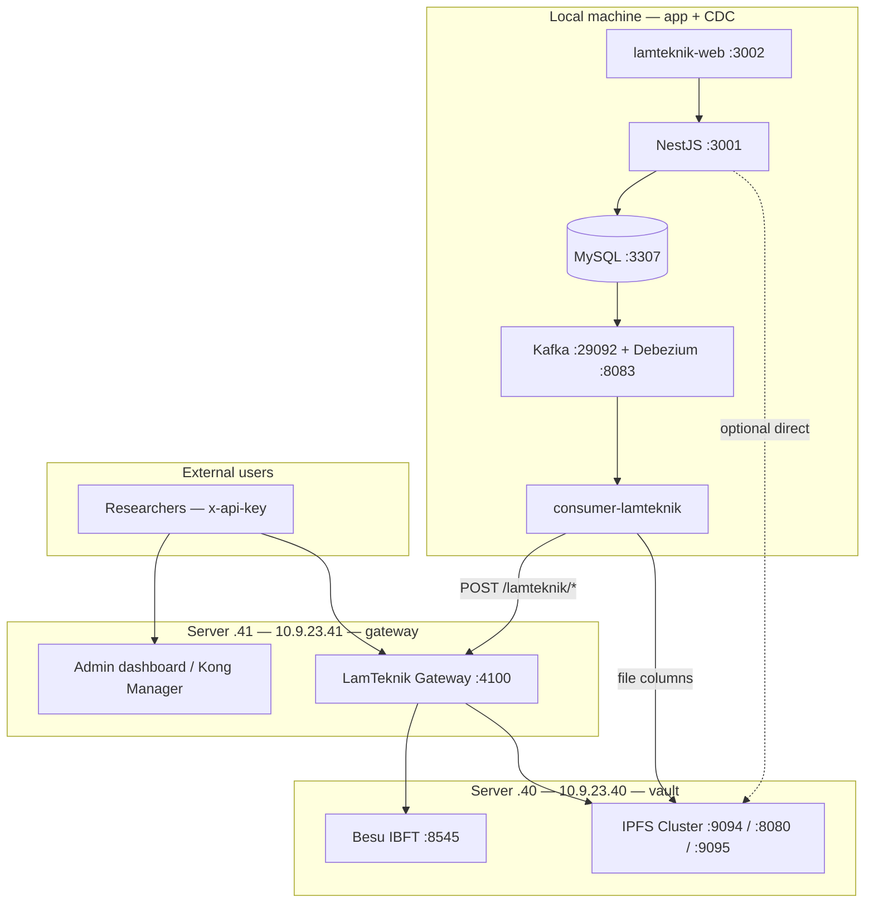

# LamTeknik Infrastructure

Target deployment layout: **blockchain + IPFS on server `.40`**, **API gateway on server `.41`**, **app + CDC on your local machine** (for now). Future scale moves app + CDC to a dedicated server (e.g. `.42`).

**Related:** [revamp-system-plan.md](./revamp-system-plan.md) · [project-overview.md](./project-overview.md)

---

## Design principles

| Principle | Meaning |
|-----------|---------|
| **Vault vs front door** | VM `.40` runs nodes only. Users never get raw Besu/IPFS ports. |
| **Bifrost-like access** | Researchers use one HTTPS base URL + `x-api-key` on the gateway (`.41`). |
| **CDC with app** | Kafka, Debezium, and `consumer-lamteknik` always live on the **same machine as MySQL** — local dev PC now, server later. |
| **Gateway on `.41` only** | Server `.41` runs gateway + admin — not the LamTeknik app stack. |
| **Hybrid pilot** | Servers host chain + gateway; you develop/run app + CDC locally and call servers over LAN/VPN. |
| **No FireFly** | Hyperledger FireFly was evaluated and dropped (poor fit for Bifrost UX + CDC + unified IPFS). |

---

## Topology

### Current layout — hybrid (now)

| Host | IP / location | Role | Public internet |
|------|---------------|------|-----------------|
| **Node vault** | `10.9.23.40` | Besu IBFT + IPFS Cluster | **No** — ufw allows trusted IPs only |
| **Gateway** | `10.9.23.41` | LamTeknik Gateway + admin dashboard (Kong optional) | Gateway port reachable from your network |
| **App + CDC** | **Your local machine** | MySQL, NestJS, lamteknik-web, Kafka, Debezium, consumer | Localhost only |



### Future scale — app + CDC on server

| Host | IP | Role |
|------|-----|------|
| **Node vault** | `10.9.23.40` | Unchanged |
| **Gateway** | `10.9.23.41` | Unchanged |
| **App + CDC** | `10.9.23.42` *(or similar)* | Move `target/` + `connection/` off local PC |

Gateway stays on `.41`. CDC still co-located with MySQL — only the host changes.

## Repository components by host

| Repo path | Server `.40` | Server `.41` | Local machine |
|-----------|--------------|--------------|---------------|
| [`backend/blockchain-besu-ibft/`](../backend/blockchain-besu-ibft/) | ✓ | | |
| [`backend/ipfs-cluster-private/`](../backend/ipfs-cluster-private/) | ✓ | | |
| [`API/`](../API/) (LamTeknik Gateway) | | ✓ | |
| [`connection/kafka-debezium/`](../connection/kafka-debezium/) | | | ✓ |
| [`connection/consumer-lamteknik/`](../connection/consumer-lamteknik/) | | | ✓ |
| [`target/`](../target/) (MySQL + NestJS) | | | ✓ |
| [`frontend/lamteknik-web/`](../frontend/lamteknik-web/) | | | ✓ |

Smart contracts (`API/contracts/*Storage.sol`) deploy to Besu on `.40`. The gateway on `.41` loads deployment artifacts from `API/build/contracts/lamteknik/`.

---

## Port matrix

### VM `.40` — node vault

| Port | Service | Docker compose | Exposed to host | Allowed callers |
|------|---------|----------------|-----------------|-----------------|
| 8545 | Besu RPC (node-1) | `blockchain-besu-ibft/docker` | All interfaces *(ufw restricts)* | `.41`, app VM |
| 8546–8548 | Besu RPC nodes 2–4 | same | All interfaces | Internal / ops |
| 8081 | Chainlens explorer | same | All interfaces | Ops only *(optional)* |
| 5001 | Kubo API + WebUI | `ipfs-cluster-private` | **127.0.0.1 only** | SSH tunnel for ops |
| 8080 | IPFS gateway | same | **Must expose to LAN** *(see revamp plan)* | `.41`, app VM |
| 9094 | IPFS Cluster REST | same | **Must expose to LAN** | `.41`, app VM (CDC files) |
| 9095 | Cluster IPFS proxy | same | All interfaces | App VM (NestJS `/api/v0/*`) |
| 9096 | Cluster swarm | same | All interfaces | Cluster peers only |
| 4001 | Kubo swarm | same | Not on host | Internal Docker network |

### VM `.41` — gateway

| Port | Service | Notes |
|------|---------|-------|
| 4100 | LamTeknik Gateway | Blockchain REST + IPFS proxy; CDC calls this internally |
| 443 / 80 | HTTPS reverse proxy | Public entry for researchers *(nginx/Caddy in front of gateway)* |
| 8000–8002 | Kong *(optional)* | Proxy + Kong Manager OSS for API key admin |
| 8001 | Kong Manager GUI | Admin dashboard for `x-api-key` profiles |

### Local machine — app + CDC

| Port | Service | Notes |
|------|---------|-------|
| 3307 | MySQL `lamtek_db` | CDC source; binlog ROW format |
| 6379 | Redis | NestJS cache |
| 3001 | NestJS API | lamteknik-web backend |
| 3002 | lamteknik-web | Frontend |
| 29092 | Kafka bootstrap | Consumer connects locally |
| 8083 | Debezium Connect REST | Connector registration |
| 8085 | Kafka UI | Debugging |

**Outbound (local → servers):**

| Target | URL | Used by |
|--------|-----|---------|
| Gateway | `http://10.9.23.41:4100` | Consumer blockchain writes |
| IPFS Cluster | `http://10.9.23.40:9094` | Consumer file columns |
| IPFS gateway | `http://10.9.23.40:8080` | NestJS file reads *(optional)* |
| IPFS proxy | `http://10.9.23.40:9095` | NestJS uploads *(optional)* |

NestJS should **not** call Besu `:8545` directly from local unless `.40` ufw allows your PC IP — prefer gateway for chain reads/writes from app code later.

## Network and firewall

### VM `.40` — node vault

**Default:** deny all incoming. Allow gateway, and **your local machine IP** (for CDC IPFS uploads).

```bash
sudo ufw default deny incoming
sudo ufw default allow outgoing

# Admin SSH (adjust subnet)
sudo ufw allow from 10.9.23.0/24 to any port 22

# Gateway VM — always
sudo ufw allow from 10.9.23.41 to any port 8545
sudo ufw allow from 10.9.23.41 to any port 9094
sudo ufw allow from 10.9.23.41 to any port 8080

# Local dev machine — replace with your PC's LAN/VPN IP
sudo ufw allow from <YOUR_LOCAL_IP> to any port 9094
sudo ufw allow from <YOUR_LOCAL_IP> to any port 8080
sudo ufw allow from <YOUR_LOCAL_IP> to any port 9095

# Future app server
sudo ufw allow from 10.9.23.42 to any port 9094
sudo ufw allow from 10.9.23.42 to any port 8080

sudo ufw enable
```

Find your IP from the server: check Debezium/consumer connection logs, or run `curl ifconfig.me` from PC if on VPN with stable IP.

**Do not** open `.40` to `0.0.0.0/0` without ufw.

### VM `.41` — gateway

Allow inbound `:4100` (and `:443` when HTTPS added) from:

- Your local machine IP (CDC consumer)
- Researcher network / campus VPN
- Optionally restrict admin UI ports to admin IP only

Gateway talks **outbound** to `.40` — ensure `.40` ufw allows `.41` as above.

---

## Traffic flows

### Researchers / external API users (Bifrost-like)

```
HTTPS + x-api-key  →  Gateway .41  →  Besu .40:8545  (contract reads/writes)
                     →  IPFS .40:9094 / :8080  (upload / download via proxy)
```

Example profile handed to a user:

```
Base URL:   https://lamtek.example/v1
API key:    sk-lamtek-research-xxxx

Blockchain entities: akreditasi, user, prodi, … (26 slugs)
IPFS:       POST /v1/ipfs/upload   GET /v1/ipfs/{cid}
```

Researchers **never** receive `10.9.23.40` or raw node ports.

### CDC pipeline (local app + CDC → servers)

```
MySQL (local :3307)
  → Debezium (local) → Kafka (local) → consumer (local)
       → file columns: IPFS Cluster  http://10.9.23.40:9094/add
       → entity rows:  Gateway         http://10.9.23.41:4100/lamteknik/{entity}
                            → Besu       http://10.9.23.40:8545
```

Requires: local PC can reach `.41:4100` and `.40:9094` (firewall + routing/VPN).

### LamTeknik web app (local)

```
lamteknik-web (local :3002) → NestJS (local :3001) → MySQL (local)
NestJS → IPFS on .40 for dokumen uploads (9095 or 9094)
NestJS → gateway on .41 for chain ops (recommended) OR direct Besu if ufw allows
```

### Operations / monitoring

| Tool | Access |
|------|--------|
| IPFS WebUI `:5001/webui` | SSH tunnel: `ssh -L 5001:127.0.0.1:5001 user@10.9.23.40` |
| Chainlens `:8081` | Restrict to admin network or SSH tunnel |
| Kafka UI `:8085` | App VM localhost or admin VPN |
| Gateway health | `GET http://10.9.23.41:4100/health` |

WebUIs are **not** required for integrations — APIs only.

---

## Environment variables (cross-VM)

### Gateway on `.41` — [`API/.env`](../API/.env.example)

```env
LAMTEKNIK_PORT=4100
BLOCKCHAIN_RPC_URL=http://10.9.23.40:8545
CHAIN_ID=1337
DEPLOYER_PRIVATE_KEY=<server signer — not shared with researchers>
IPFS_CLUSTER_REST_URL=http://10.9.23.40:9094
IPFS_GATEWAY_URL=http://10.9.23.40:8080
CORS_ORIGIN=*
# Future: API_KEYS_FILE or admin-managed key store
```

### Consumer on local machine — [`connection/consumer-lamteknik/.env`](../connection/consumer-lamteknik/.env.example)

```env
API_ENDPOINT=http://10.9.23.41:4100
IPFS_CLUSTER_REST_URL=http://10.9.23.40:9094
KAFKA_BROKER=127.0.0.1:29092
KAFKA_CONNECT_URL=http://127.0.0.1:8083
DB_HOST=127.0.0.1
DB_PORT=3307
```

### NestJS on local machine — [`target/docker-compose.yml`](../target/docker-compose.yml)

Use `host.docker.internal` or your host LAN IP to reach servers from Docker:

```env
BESU_RPC_URL=http://10.9.23.41:4100/lamteknik   # via gateway (future)
# Or direct if ufw allows your IP:
BESU_RPC_URL=http://10.9.23.40:8545
IPFS_API_URL=http://10.9.23.40:9095
IPFS_GATEWAY_URL=http://10.9.23.40:8080
```

On Linux Docker, add `extra_hosts: ["host.docker.internal:host-gateway"]` if using host networking tricks.

---

## Security model

| Actor | Auth | Reaches |
|-------|------|---------|
| Researcher | `x-api-key` via gateway | `/v1/lamteknik/*`, `/v1/ipfs/*` on `.41` only |
| CDC consumer | None *(trust: your PC on private network)* | Gateway `.41:4100`, IPFS `.40:9094` |
| NestJS app | JWT for app users; infra uses env URLs | MySQL local; Besu/IPFS on `.40` |
| Admin | SSH + gateway/Kong admin UI | Key creation, connector config, node ops |
| Public internet | Blocked from `.40` | ufw on node vault |

**Signing:** Gateway holds `DEPLOYER_PRIVATE_KEY` for automated CDC and default writes. Per-researcher keys gate *access*; optional future mapping to dedicated Besu keys per profile.

---

## What we explicitly rejected

| Option | Reason |
|--------|--------|
| **Hyperledger FireFly** | No Bifrost-like admin UI; IPFS not available in gateway mode; CDC route rewrite; high ops cost |
| **Expose Besu/IPFS to internet** | Unauthenticated RPC and cluster REST are unsafe |
| **CDC on gateway VM separate from MySQL** | Cross-VM binlog / Debezium complexity; CDC must follow app |
| **Raw node access for researchers** | Bypasses key revocation, rate limits, and audit |

---

## Startup order (hybrid layout)

| Order | Host | Component |
|-------|------|-----------|
| 1 | Server `.40` | Besu IBFT + IPFS Cluster (+ ufw + IPFS port bind fix) |
| 2 | Server `.40` | Deploy contracts (`API/` Hardhat) if not yet deployed |
| 3 | Server `.41` | LamTeknik Gateway container |
| 4 | **Local** | MySQL + NestJS (`target/docker compose up`) |
| 5 | **Local** | Kafka + Debezium (`connection/kafka-debezium/`) |
| 6 | **Local** | Register Debezium connector + start consumer |
| 7 | **Local** | lamteknik-web frontend |
| 8 | Server `.41` | *(Optional)* Kong + HTTPS |

---

## Future scale checklist (local → server `.42`)

1. Provision app server; install Docker.
2. Move `target/` + `connection/` stacks from local PC to server.
3. Add new server IP to `.40` ufw; remove local PC IP if no longer needed.
4. Consumer `API_ENDPOINT` stays `http://10.9.23.41:4100`.
5. Re-register Debezium connector (MySQL now on server, still local to Debezium).
6. Gateway on `.41` unchanged.

Gateway VM does **not** run Kafka or MySQL.
