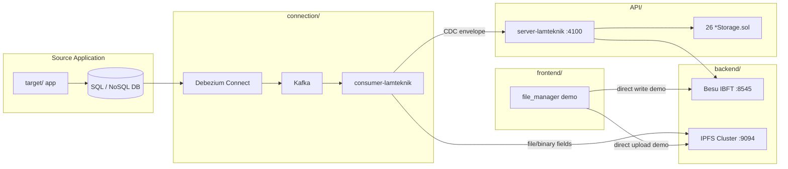

# LamTeknik Blockchain — Project Overview

## Purpose

This repository is a **developer project template** for building **Change Data Capture (CDC)** pipelines that sync an existing application database to **Hyperledger Besu** (blockchain) and **IPFS** (file storage).

The current reference implementation uses the **LamTeknik** accreditation domain (26 entity storage contracts), but the structure is designed to be reused for any SQL/NoSQL source application.

Pattern reference: [`repo/blockchain-erp-integration/`](../repo/blockchain-erp-integration/) (ERPNext → Kafka → Besu CDC).

## Architecture

## Data routing rules

| Record content | Storage |
|---|---|
| String/scalar fields only | CDC envelope → Besu via `POST /lamteknik/{entity}` |
| Contains file/binary columns | Bytes → IPFS Cluster; CID + metadata embedded in `allData` → Besu |

The on-chain CDC envelope (all entities):

- `recordId`, `createdTimestamp`, `modifiedTimestamp`, `modifiedBy`, `allData` (JSON string)

## Repository map

| Folder | Role |
|---|---|
| [`backend/blockchain-besu-ibft/`](../backend/blockchain-besu-ibft/) | 4-node private Besu IBFT network |
| [`backend/ipfs-cluster-private/`](../backend/ipfs-cluster-private/) | Private IPFS Cluster (4 peers) |
| [`API/`](../API/) | Express REST API + Solidity `*Storage` contracts |
| [`connection/`](../connection/) | Kafka, Debezium, CDC consumer |
| [`target/`](../target/) | Source application placeholder (populated later) |
| [`frontend/file_manager/`](../frontend/file_manager/) | Separate file-storage demo (direct Besu + IPFS, not CDC) |
| [`context/`](../context/) | Project context and progress tracking |

## Developer flow

1. Start Besu and IPFS cluster (`backend/`).
2. Deploy smart contracts and run the LamTeknik API (`API/`).
3. Start Kafka + Debezium (`connection/kafka-debezium/`).
4. Configure and register a Debezium connector for the source DB (`connection/consumer-lamteknik/`).
5. Run the CDC consumer — changes in the source DB appear on-chain (and in IPFS for file fields).
6. Wire up the target application in `target/` when ready.

## Features

### Implemented

- Besu IBFT 4-node network with genesis and run guides
- IPFS private cluster with replication
- 26 LamTeknik `*Storage` smart contracts + auto-generated REST routes
- Kafka + Debezium Connect stack (Docker)
- `consumer-lamteknik` — Kafka consumer with batch processing, dedup, idempotency, IPFS routing
- Env-driven multi-DB connector registration (MySQL, PostgreSQL, MongoDB, SQL Server)
- File Manager frontend demo (direct upload path, separate from CDC)

### Planned / placeholder

- Source application in `target/`
- IPFS REST API guide (`API/command/how-to-ipfs-api.md`)
- Production HA Kafka, dead-letter queues, outbox pattern

## Scope

### In scope

- CDC middleware template reusable across projects
- LamTeknik entity contracts and API as reference case
- Documentation and diagnostic scripts for local development

### Out of scope (current)

- Populating `target/` with a full LamTeknik source app
- Production deployment, monitoring, and credential management
- Replacing the File Manager's synchronous write path with CDC (they coexist as separate demos)

## Success criteria

1. A developer can start the full stack locally and register a Debezium connector by editing `.env.local`.
2. Database row changes flow through Kafka to Besu with the standard CDC envelope.
3. File/binary columns are stored in IPFS with CIDs referenced on-chain.
4. Documentation clearly separates CDC path vs File Manager direct-upload path.
