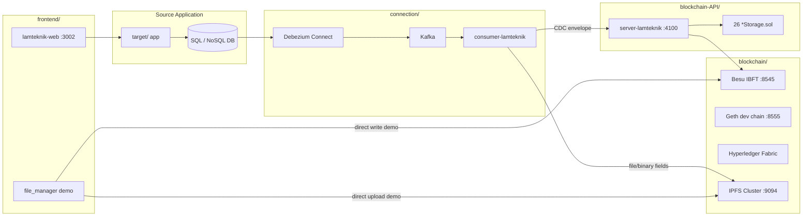

# LamTeknik Blockchain Project Overview

## Purpose

This repository is a **developer project template** for building **Change Data Capture (CDC)** pipelines that sync an existing application database to **Hyperledger Besu** (blockchain) and **IPFS** (file storage).

The current reference implementation uses the **LamTeknik** accreditation domain (26 entity storage contracts), but the structure is designed to be reused for any SQL/NoSQL source application.

Pattern reference: [`repo/blockchain-erp-integration/`](../repo/blockchain-erp-integration/) (ERPNext → Kafka → Besu CDC).

## Architecture

```mermaid
flowchart LR
  subgraph source [Source Application]
    TargetApp[target/ app]
    SourceDB[(SQL / NoSQL DB)]
  end

  subgraph connection [connection/]
    Debezium[Debezium Connect]
    Kafka[Kafka]
    Consumer[consumer-lamteknik]
  end

  subgraph blockchain [blockchain/]
    Besu[Besu IBFT :8545]
    Geth[Geth dev chain :8555]
    Fabric[Hyperledger Fabric]
    IPFS[IPFS Cluster :9094]
  end

  subgraph api [blockchain-API/]
    RestAPI[server-lamteknik :4100]
    Contracts["26 *Storage.sol"]
  end

  subgraph frontend [frontend/]
    FileManager[file_manager demo]
    LamteknikWeb[lamteknik-web :3002]
  end

  TargetApp --> SourceDB
  SourceDB --> Debezium --> Kafka --> Consumer
  Consumer -->|file/binary fields| IPFS
  Consumer -->|CDC envelope| RestAPI --> Besu
  RestAPI --> Contracts
  FileManager -->|direct upload demo| IPFS
  FileManager -->|direct write demo| Besu
  LamteknikWeb --> TargetApp
```

## Data routing rules

| Record content | Storage |
|---|---|
| String/scalar fields only | CDC envelope → Besu via `POST /lamteknik/{entity}` |
| Contains file/binary columns | Bytes → IPFS Cluster; CID + metadata embedded in `allData` → Besu |

The on-chain CDC envelope (all entities):

- `recordId`, `createdTimestamp`, `modifiedTimestamp`, `modifiedBy`, `allData` (JSON string)

## Repository map

| Folder | Role |
|---|---|
| [`blockchain/blockchain-besu-ibft/`](../blockchain/blockchain-besu-ibft/) | 4-node private Besu IBFT network |
| [`blockchain/go-ethereum/`](../blockchain/go-ethereum/) | Single-node Geth development chain with Chainlens explorer |
| [`blockchain/hyperledger-fabric/`](../blockchain/hyperledger-fabric/) | Two-organization Fabric test network with Hyperledger Explorer |
| [`blockchain/ipfs-cluster-private/`](../blockchain/ipfs-cluster-private/) | Private IPFS Cluster (4 peers) |
| [`blockchain-API/`](../blockchain-API/) | Express REST API + Solidity `*Storage` contracts |
| [`connection/`](../connection/) | Kafka, Debezium, CDC consumer |
| [`target/`](../target/) | LamTeknik NestJS source app + MySQL (CDC source) |
| [`frontend/file_manager/`](../frontend/file_manager/) | Direct Besu + IPFS file demo (not CDC) |
| [`frontend/lamteknik-web/`](../frontend/lamteknik-web/) | LamTeknik SaaS UI → `target/backend` API |
| [`context/`](../context/) | Project context and progress tracking |

## Developer flow

1. On VM `.40`, manually start the selected network from `blockchain/`; run only one blockchain network at a time. Besu is currently turned off intentionally.
2. Deploy smart contracts and run the LamTeknik gateway from `blockchain-API/`.
3. Start Kafka + Debezium (`connection/kafka-debezium/`).
4. Configure and register a Debezium connector for the source DB (`connection/consumer-lamteknik/`).
5. Run the CDC consumer — changes in the source DB appear on-chain (and in IPFS for file fields).
6. Start the `lamteknik-webapp` stack (`target/docker-compose.yml`) containing MySQL, Redis, NestJS, and the LamTeknik web UI.

## Features

### Implemented

- Besu IBFT 4-node network with genesis and run guides
- Geth development chain and Chainlens stack (transferred; not yet API-integrated)
- Hyperledger Fabric test network and Explorer stack (transferred; not yet API-integrated)
- IPFS private cluster with replication
- 26 LamTeknik `*Storage` smart contracts + auto-generated REST routes
- Kafka + Debezium Connect stack (Docker)
- `consumer-lamteknik` — target-routed Kafka consumer with explicit post-transaction offset commits, dedup, idempotency, and IPFS routing; its Portainer stack deploys one stopped/started-on-demand consumer per supported blockchain target
- `consumer-erp` — ERPNext Employee and Attendance CDC consumer; it writes only through the Besu gateway namespace and never handles a blockchain private key
- Env-driven multi-DB connector registration (MySQL, PostgreSQL, MongoDB, SQL Server)
- File Manager frontend demo (direct upload path, separate from CDC)
- LamTeknik web UI (`frontend/lamteknik-web/`) + NestJS backend (`target/backend/`) with demo SQL seeds

### Planned / placeholder

- IPFS REST API guide (`blockchain-API/command/how-to-ipfs-api.md`)
- Production HA Kafka, dead-letter queues, outbox pattern

## Scope

### In scope

- CDC middleware template reusable across projects
- LamTeknik entity contracts and API as reference case
- Documentation and diagnostic scripts for local development

### Out of scope (current)

- Production deployment, monitoring, and credential management
- Replacing the File Manager's synchronous write path with CDC (they coexist as separate demos)

## Success criteria

1. A developer can start the full stack locally and register a Debezium connector by editing `.env.local`.
2. Database row changes flow through Kafka to Besu with the standard CDC envelope.
3. File/binary columns are stored in IPFS with CIDs referenced on-chain.
4. Documentation clearly separates CDC path vs File Manager direct-upload path.
