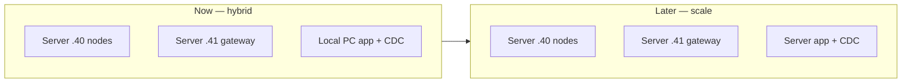

# LamTeknik System Revamp — Implementation Plan

Step-by-step plan to deploy the multi-VM layout described in [infrastructure.md](./infrastructure.md).

**Status:** Planned — not yet executed.

**Goal:** Servers `.40` (nodes) + `.41` (gateway); **app + CDC on your local machine** for now. Bifrost-like gateway access without FireFly.

---

## Outcomes

When complete:

1. Server `.40` runs Besu + IPFS only, firewalled to `.41` + your local PC IP.
2. Server `.41` runs the **LamTeknik Gateway** (containerized `API/`) with optional Kong admin UI.
3. **Local machine** runs LamTeknik app + **Kafka + Debezium + consumer** + MySQL.
4. Researchers use `https://<gateway>/v1` + `x-api-key` on `.41`.
5. CDC: local MySQL → local Kafka → local consumer → gateway `.41` → Besu `.40`; files → IPFS `.40` direct.

---


## Architecture summary



| Host | Runs |
|------|------|
| `10.9.23.40` | Besu + IPFS |
| `10.9.23.41` | LamTeknik Gateway + admin |
| **Your PC** | MySQL, NestJS, web, Kafka, Debezium, consumer |


---


## Phase 0 — Prerequisites


| Item | Action |
|------|--------|
| Servers | `.40` and `.41` provisioned; reachable from your PC (LAN/VPN) |
| Local PC | Docker + Node.js for app, CDC, and optional contract deploy |
| Git | Clone repo on servers and local PC |
| Secrets | `swarm.key`, `CLUSTER_SECRET` on `.40`; gateway `.env` on `.41` |
| Network | Add your PC IP to `.40` ufw; test reachability to `.41:4100` and `.40:9094` |


**Docs to read:**

- `[backend/blockchain-besu-ibft/command/run-besu-ibft.md](../backend/blockchain-besu-ibft/command/run-besu-ibft.md)`
- `[backend/ipfs-cluster-private/command/run-ipfs-private.md](../backend/ipfs-cluster-private/command/run-ipfs-private.md)`
- `[API/command/how-to-blockchain-api.md](../API/command/how-to-blockchain-api.md)`
- `[connection/command/run-kafka-debezium.md](../connection/command/run-kafka-debezium.md)`

---


## Phase 1 — Node vault (VM `.40`)


### 1.1 Start Besu IBFT

```bash
cd backend/blockchain-besu-ibft/docker
docker compose up -d
```

Verify: `curl -s -X POST http://127.0.0.1:8545 -H "Content-Type: application/json" -d '{"jsonrpc":"2.0","method":"eth_blockNumber","params":[],"id":1}'`

### 1.2 Start IPFS Cluster

```bash
cd backend/ipfs-cluster-private
# swarm.key, .env, webui CAR per run-ipfs-private.md
docker compose up -d
```


### 1.3 Expose IPFS to trusted VMs (critical)

Edit `[backend/ipfs-cluster-private/docker-compose.yml](../backend/ipfs-cluster-private/docker-compose.yml)`:


| Service    | Change                                      |
| ---------- | ------------------------------------------- |
| `cluster0` | `127.0.0.1:9094:9094` → `9094:9094`         |
| `ipfs0`    | `127.0.0.1:8080:8080` → `8080:8080`         |
| `ipfs0`    | Keep `127.0.0.1:5001:5001` (WebUI ops only) |


```bash
docker compose up -d --force-recreate ipfs0 cluster0
```


### 1.4 Configure firewall

Apply ufw rules from [infrastructure.md](./infrastructure.md#network-and-firewall-vm-40).

Verify from **your local PC**:

```bash
curl -s http://10.9.23.40:9094/id
curl -s -X POST http://10.9.23.40:8545 -H "Content-Type: application/json" \
  -d '{"jsonrpc":"2.0","method":"eth_blockNumber","params":[],"id":1}'
```

Add your PC IP to `.40` ufw before this will work for IPFS.


### 1.5 Deploy smart contracts

Run deploy from **local PC or `.41`** — any host that can reach Besu:

```bash
cd API
# BLOCKCHAIN_RPC_URL=http://10.9.23.40:8545
npm run deploy:lamteknik
```

Copy `API/build/contracts/lamteknik/` to server `.41` for the gateway container, or deploy on `.41` directly.

**Deliverable:** `.40` nodes healthy, contracts deployed, IPFS/Besu reachable from `.41` only.

---


## Phase 2 — LamTeknik Gateway (VM `.41`)

Extend `[API/server-lamteknik.js](../API/server-lamteknik.js)` into a Bifrost-like gateway.

### 2.1 Containerize API

Create:


| File                     | Purpose                                                                 |
| ------------------------ | ----------------------------------------------------------------------- |
| `API/Dockerfile`         | Multi-stage: `npm ci`, compile, runtime with `node server-lamteknik.js` |
| `API/docker-compose.yml` | Service on `:4100`; volume for `build/contracts/lamteknik/`             |
| `API/.env.example`       | Document cross-VM URLs (see infrastructure.md)                          |


`.env` on `.41`:

```env
LAMTEKNIK_PORT=4100
BLOCKCHAIN_RPC_URL=http://10.9.23.40:8545
CHAIN_ID=1337
DEPLOYER_PRIVATE_KEY=<genesis dev key or dedicated signer>
IPFS_CLUSTER_REST_URL=http://10.9.23.40:9094
IPFS_GATEWAY_URL=http://10.9.23.40:8080
```


### 2.2 API key authentication

Add to `server-lamteknik.js`:


| Feature   | Detail                                                                                                    |
| --------- | --------------------------------------------------------------------------------------------------------- |
| Header    | `x-api-key: sk-...`                                                                                       |
| Key store | Env `API_KEYS` JSON file, or `API/keys.json` volume *(simple admin edit)*                                 |
| Bypass    | `API_KEY_REQUIRED=false` for local dev; internal CDC uses localhost without key or dedicated internal key |
| Profiles  | Per key: `allowedEntities[]`, optional rate limit metadata                                                |


Routes requiring keys: all `/lamteknik/*` and `/ipfs/*` except `GET /health`.

CDC consumer on same or trusted network: use internal bypass or fixed internal key.

### 2.3 IPFS proxy routes

Implement routes planned in `[API/command/how-to-ipfs-api.md](../API/command/how-to-ipfs-api.md)`:


| Method | Path                                | Backend                                             |
| ------ | ----------------------------------- | --------------------------------------------------- |
| `POST` | `/v1/ipfs/upload` or `/ipfs/upload` | Proxy to `http://10.9.23.40:9094/add?cid-version=1` |
| `GET`  | `/v1/ipfs/:cid`                     | Proxy to `http://10.9.23.40:8080/ipfs/:cid`         |
| `GET`  | `/v1/ipfs/:cid/metadata`            | Cluster status / dag stat                           |


Update `[API/command/how-to-ipfs-api.md](../API/command/how-to-ipfs-api.md)` when implemented.

### 2.4 Optional — Kong admin dashboard (Bifrost-like UI)

If env-based key files are too manual, add Kong on `.41`:


| Kong object | Config                                                              |
| ----------- | ------------------------------------------------------------------- |
| Upstream    | `lamteknik-gateway:4100`                                            |
| Route       | `/v1` → gateway                                                     |
| Plugin      | `key-auth` with header `x-api-key`                                  |
| Admin       | Kong Manager OSS on `:8002` — create Consumers + credentials in GUI |


Gateway can stay key-aware internally, or Kong terminates auth and gateway trusts internal network only.

**Deliverable:** `curl http://10.9.23.41:4100/health` shows `contractsLoaded: 26`; researcher POST with valid key succeeds.

---


## Phase 3 — App + CDC (local machine)

All steps run on **your PC**, not on server `.41`.

### 3.1 Target application stack

```bash
cd target
# docker-compose: IPFS_* → http://10.9.23.40:...
docker compose up -d --build
```

Verify: `curl http://localhost:3001/api/v1/health`

### 3.2 Kafka + Debezium

```bash
cd connection/kafka-debezium
docker compose up -d
```

Verify: `curl http://localhost:8083/connectors`

### 3.3 Consumer + connector

```bash
cd connection/consumer-lamteknik
cp .env.example .env.local
```

Set in `.env.local`:

```env
API_ENDPOINT=http://10.9.23.41:4100
IPFS_CLUSTER_REST_URL=http://10.9.23.40:9094
KAFKA_BROKER=127.0.0.1:29092
KAFKA_CONNECT_URL=http://127.0.0.1:8083
DB_HOST=127.0.0.1
DB_PORT=3307
```

```bash
npm install
node add-lamteknik-connector.js
node server.js
```

### 3.4 Frontend

```bash
cd frontend/lamteknik-web
npm install && npm run dev
```

**Deliverable:** App on localhost; consumer reaches gateway `.41` and IPFS `.40`.

---


## Phase 4 — Integration testing


### 4.1 Gateway smoke test

```bash
curl http://10.9.23.41:4100/health
curl http://10.9.23.41:4100/lamteknik
curl -H "x-api-key: <test-key>" \
  http://10.9.23.41:4100/lamteknik/akreditasi/count
```


### 4.2 CDC end-to-end

1. Update a row in `akreditasi` via NestJS or MySQL CLI.
2. Confirm Kafka topic receives event (Kafka UI `:8085`).
3. Consumer logs `[OK] /lamteknik/akreditasi ...`.
4. Verify on-chain: `GET /lamteknik/akreditasi/{id}` on gateway.


### 4.3 IPFS file column

1. Update a row with a file/binary column watched by consumer.
2. Consumer logs `[IPFS] table/id.field -> bafy...`.
3. Confirm CID retrievable via gateway `/ipfs/{cid}` or `.40:8080`.


### 4.4 Researcher profile test

Hand test user a profile sheet:

```
Base URL: http://10.9.23.41:4100/v1
API key:  sk-test-xxxx
Entities: akreditasi, user, ...
```

Confirm POST store + GET read work with key; fail without key.

**Deliverable:** All four tests pass; document results in `[progress-tracker.md](./progress-tracker.md)`.

---


## Phase 5 — Hardening (optional, post-pilot)


| Task                     | Detail                                                                   |
| ------------------------ | ------------------------------------------------------------------------ |
| HTTPS                    | Caddy/nginx on `.41` → gateway `:4100`; Let's Encrypt                    |
| Kong production          | Move key admin to Kong Manager; rate limiting plugin                     |
| Per-researcher Besu keys | Fund separate keys on Besu dev chain; map in gateway profile             |
| Monitoring               | Prometheus/Grafana on `.40` or central ops VM                            |
| Secrets                  | Move `DEPLOYER_PRIVATE_KEY` to env file outside git; rotate API keys     |
| Docs                     | Update `[run-all.md](../run-all.md)` with multi-VM section pointing here |


---


## Phase 6 — Scale app + CDC to server (future)

When the local PC is no longer enough:

1. Provision app server (e.g. `10.9.23.42`).
2. Move `target/` + `connection/` from local PC to that server.
3. Update `.40` ufw: add server IP; remove local PC IP if no longer needed.
4. Consumer env unchanged: `API_ENDPOINT=http://10.9.23.41:4100`.
5. Re-register Debezium connector (MySQL now on server, still local to Debezium).
6. Gateway on `.41` unchanged. Re-run Phase 4 tests.

**Do not split CDC from MySQL** — always move app + CDC as one bundle.

---

## Implementation checklist

| # | Task | Host | Status |
|---|------|------|--------|
| 1 | Besu + IPFS up | Server `.40` | ☐ |
| 2 | IPFS ports + ufw (`.41` + your PC IP) | Server `.40` | ☐ |
| 3 | Contracts deployed | `.40` / `API` | ☐ |
| 4 | Gateway Docker on `.41` | Server `.41` | ☐ |
| 5 | `x-api-key` + IPFS routes | `API/` | ☐ |
| 6 | Target stack | **Local PC** | ☐ |
| 7 | Kafka + Debezium + consumer | **Local PC** | ☐ |
| 8 | CDC smoke test | **Local PC** | ☐ |
| 9 | Researcher key test | Server `.41` | ☐ |
| 10 | *(Future)* Move app+CDC to server | Server | ☐ |


---


## Files to create or modify


| Path                                              | Action                                        |
| ------------------------------------------------- | --------------------------------------------- |
| `context/infrastructure.md`                       | ✅ Written — VM layout reference               |
| `context/revamp-system-plan.md`                   | ✅ This file                                   |
| `backend/ipfs-cluster-private/docker-compose.yml` | Change port binds `9094`, `8080`              |
| `API/Dockerfile`                                  | Create                                        |
| `API/docker-compose.yml`                          | Create                                        |
| `API/server-lamteknik.js`                         | Add auth + IPFS routes                        |
| `API/.env.example`                                | Cross-VM vars + key config                    |
| `API/command/how-to-ipfs-api.md`                  | Complete TODO                                 |
| `target/docker-compose.yml`                       | Replace `host.docker.internal` with `.40` IPs |
| `connection/consumer-lamteknik/.env.example`      | Document `API_ENDPOINT` per layout            |
| `run-all.md`                                      | Add pointer to multi-VM docs *(optional)*     |
| `context/progress-tracker.md`                     | Update after each phase completes             |


---


## Decisions log


| Date | Decision |
|------|----------|
| 2026-08-11 | Drop Hyperledger FireFly |
| 2026-08-11 | Server `.40` = nodes; Server `.41` = gateway + admin |
| 2026-08-11 | CDC co-located with MySQL (never on gateway VM) |
| 2026-08-17 | **App + CDC on local PC**; servers for chain + gateway only |
| 2026-08-11 | LamTeknik Gateway = extend `API/server-lamteknik.js` |


---


## References

- [infrastructure.md](./infrastructure.md) — ports, firewall, env vars, traffic flows
- [project-overview.md](./project-overview.md) — CDC envelope and repo map
- [progress-tracker.md](./progress-tracker.md) — session progress
- Internal Cursor plan: `.cursor/plans/two-vm_api_gateway_49064ad2.plan.md`

