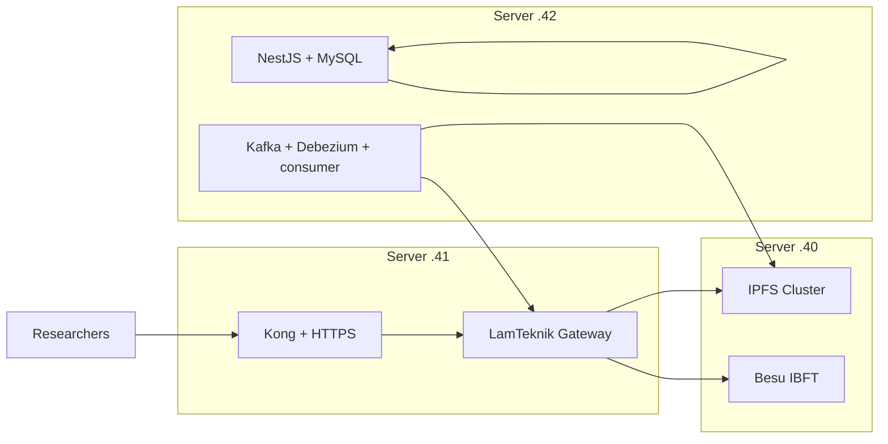
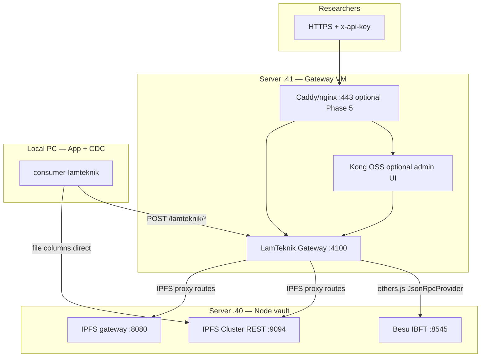

# LamTeknik System Revamp — Implementation Plan

Step-by-step plan to deploy the multi-VM layout described in [infrastructure.md](./infrastructure.md).

**Status:** Planned — not yet executed.

**Last updated:** 2026-09-03

**Goal:** All production work runs **on VMs** — not local Docker. Servers `.40` (nodes), `.41` (gateway), `.42` (app + CDC). Bifrost-like gateway access without FireFly.

**VM runbooks (execute in order):**

- [vm-40-node-vault-plan.md](./vm-40-node-vault-plan.md) — Besu + IPFS on `10.9.23.40`
- [vm-41-gateway-plan.md](./vm-41-gateway-plan.md) — Gateway + Kong on `10.9.23.41`

---

## Outcomes

When complete:

1. Server `.40` runs Besu + IPFS only, firewalled to `.41` + `.42`.
2. Server `.41` runs the **LamTeknik Gateway** (containerized `API/`) + **Kong Manager** for API keys.
3. Server `.42` runs LamTeknik app + **Kafka + Debezium + consumer** + MySQL.
4. Researchers use `https://<gateway>/v1` + `x-api-key` on `.41`.
5. CDC: `.42` MySQL → Kafka → consumer → gateway `.41` → Besu `.40`; files → IPFS `.40` direct.

---

## Architecture summary



| Host | Runs |
|------|------|
| `10.9.23.40` | Besu + IPFS — [vm-40-node-vault-plan.md](./vm-40-node-vault-plan.md) |
| `10.9.23.41` | LamTeknik Gateway + Kong — [vm-41-gateway-plan.md](./vm-41-gateway-plan.md) |
| `10.9.23.42` | MySQL, NestJS, web, Kafka, Debezium, consumer |

---

## Blockchain API Gateway — what we use

The gateway is **not** a third-party product. It is a **custom LamTeknik Gateway** built by extending the existing [`API/server-lamteknik.js`](../API/server-lamteknik.js).

| Decision | Choice |
|----------|--------|
| **Gateway product** | Custom Express + ethers.js service (`server-lamteknik.js`) |
| **Rejected** | Hyperledger FireFly (no Bifrost-like admin, no IPFS in gateway mode, CDC route rewrite, high ops cost) |
| **Analogy** | Bifrost-style: one HTTPS base URL + `x-api-key` for researchers |
| **Host** | Server `10.9.23.41` only — not on the node vault (`.40`) or app/CDC machine |
| **Port** | `:4100` (internal); public entry via HTTPS reverse proxy later |

Researchers never receive raw Besu (`:8545`) or IPFS Cluster (`:9094`) URLs.

### Gateway technology stack



#### Core runtime (required)

| Layer | Technology | Role |
|-------|------------|------|
| HTTP server | **Express.js** (`server-lamteknik.js`) | REST API, route mounting, middleware |
| Blockchain client | **ethers.js v6** | Besu RPC reads/writes, tx signing |
| Contract artifacts | **Hardhat** deploy output in `API/build/contracts/lamteknik/` | 26 `*Storage.sol` ABIs + addresses loaded at startup |
| Container | **Docker** (`API/Dockerfile` + `API/docker-compose.yml`) | Deploy on `.41` |
| Config | **`.env`** on `.41` | Cross-VM URLs, signer key, API keys |

#### Authentication (required — not yet built)

| Layer | Technology | Role |
|-------|------------|------|
| Auth header | `x-api-key: sk-...` | Researcher access control |
| Key store (pilot) | Env `API_KEYS` JSON or mounted `API/keys.json` | Simple file-based key admin |
| Key profiles | Per-key `allowedEntities[]`, optional rate-limit metadata | Scope researchers to specific entity slugs |
| Internal bypass | `API_KEY_REQUIRED=false` for dev; dedicated internal key for CDC | Consumer on local PC calls gateway without researcher keys |

Auth is implemented **inside Express first** — not delegated to a separate product.

Optional npm helpers for rate limiting: `express-rate-limit` or `api-rate-guard` (per-key `keyGenerator`).

#### Optional add-ons (Phase 2.4 / Phase 5)

| Layer | Technology | When to use |
|-------|------------|-------------|
| API management UI | **Kong OSS + Kong Manager** (`:8000–8002`) | When env-based key files are too manual; GUI for Consumers + `key-auth` credentials |
| HTTPS termination | **Caddy or nginx** on `.41` | Production researcher access |
| Rate limiting | Kong `rate-limiting` plugin | Post-pilot hardening |

**Kong is optional, not the core gateway.** Two valid modes:

1. **Pilot (simpler):** Express handles `x-api-key` directly; no Kong.
2. **Production admin:** Kong terminates auth at the edge; gateway trusts internal network only.

### Library options evaluated (2026-09-03)

No drop-in library replaces the full LamTeknik gateway (26 entity routes + CDC envelope + IPFS proxy) without rework.

| Option | Fit | Notes |
|--------|-----|-------|
| **Extend `server-lamteknik.js`** | **Best — chosen** | Already has 26 entity routes, CDC envelope, consumer integration |
| **Kong OSS** | Good auth/admin layer | `key-auth` plugin + Kong Manager GUI; optional on `.41` |
| **EthConnect** ([hyperledger/firefly-ethconnect](https://github.com/hyperledger/firefly-ethconnect)) | Partial | ABI→REST for Besu; different route shape than CDC consumer expects |
| **Hyperledger FireFly** | Rejected | Evaluated and dropped — see decisions log |
| **aragon/ipfs-api-proxy** | IPFS only | `X-API-KEY` + upload proxy; reference for IPFS routes, not full gateway |
| **Turbine / CascadeRPC / nodecore** | Wrong layer | JSON-RPC proxies for public chains; not entity REST + IPFS |

**Recommendation:** keep custom Express gateway; optionally add Kong for admin UI in Phase 5.

### Gateway — exists today vs must be built

#### Already implemented ([progress-tracker.md](./progress-tracker.md))

- [`API/server-lamteknik.js`](../API/server-lamteknik.js) — Express + ethers, auto-routes for 26 entities under `/lamteknik/{entity}`
- Hardhat deploy (`npm run deploy:lamteknik`), Postman collection, guides
- Works locally on `:4100` with **no auth**, **no IPFS proxy**, **no Docker**

#### Must be built (Phase 2)

| # | Work item | Files |
|---|-----------|-------|
| 1 | Dockerize gateway | `API/Dockerfile`, `API/docker-compose.yml` |
| 2 | `x-api-key` middleware | `API/server-lamteknik.js`, `API/.env.example` |
| 3 | IPFS proxy routes | `server-lamteknik.js`, `API/command/how-to-ipfs-api.md` |
| 4 | Cross-VM env vars | `BLOCKCHAIN_RPC_URL`, `IPFS_*` pointing to `.40` |
| 5 | `/v1` prefix (optional alias) | Map `/v1/lamteknik/*` and `/v1/ipfs/*` for researchers |
| 6 | Deploy to `.41` | Contract artifacts volume; smoke test from local consumer |

### Gateway API surface

#### Blockchain routes (existing — add auth)

| Method | Path | Notes |
|--------|------|-------|
| `GET` | `/health` | No key required |
| `GET` | `/lamteknik` | List entities |
| `GET` | `/lamteknik/{entity}/count`, `/:recordId`, etc. | Read contract state |
| `POST` | `/lamteknik/{entity}` | CDC envelope write; signed by gateway `DEPLOYER_PRIVATE_KEY` |

Researcher-facing URL pattern: `https://<gateway>/v1/lamteknik/akreditasi/count`

#### IPFS proxy routes (new)

| Method | Path | Backend on `.40` |
|--------|------|------------------|
| `POST` | `/v1/ipfs/upload` | `http://10.9.23.40:9094/add?cid-version=1` |
| `GET` | `/v1/ipfs/:cid` | `http://10.9.23.40:8080/ipfs/:cid` |
| `GET` | `/v1/ipfs/:cid/metadata` | Cluster status / DAG stat |

**Note:** the CDC consumer still uploads file columns **directly** to `.40:9094` (bypasses gateway). Researchers use the gateway IPFS routes.

### Security model

| Actor | Auth | Reaches |
|-------|------|---------|
| Researcher | `x-api-key` via gateway | `/v1/lamteknik/*`, `/v1/ipfs/*` on `.41` only |
| CDC consumer | Internal key or trusted network bypass | Gateway `.41:4100` + IPFS `.40:9094` direct |
| Gateway signer | `DEPLOYER_PRIVATE_KEY` in env | Signs automated/on-behalf writes to Besu |
| Public internet | Blocked from `.40` | ufw on node vault |

Researchers get **access keys**, not Besu private keys. Optional future: map researcher profiles to dedicated Besu keys.

---

## Phase 0 — Prerequisites

| Item | Action |
|------|--------|
| Servers | `.40`, `.41`, and `.42` provisioned; reachable from admin network (LAN/VPN) |
| VM-only | Implement on VMs — do not rely on local Docker for production stack |
| Git | Clone repo on each VM |
| Secrets | `swarm.key`, `CLUSTER_SECRET` on `.40`; gateway `.env` on `.41` |
| Network | Add `.41` + `.42` IPs to `.40` ufw; test reachability before gateway go-live |

**Docs to read:**

- [`backend/blockchain-besu-ibft/command/run-besu-ibft.md`](../backend/blockchain-besu-ibft/command/run-besu-ibft.md)
- [`backend/ipfs-cluster-private/command/run-ipfs-private.md`](../backend/ipfs-cluster-private/command/run-ipfs-private.md)
- [`API/command/how-to-blockchain-api.md`](../API/command/how-to-blockchain-api.md)
- [`connection/command/run-kafka-debezium.md`](../connection/command/run-kafka-debezium.md)

---

## Phase 1 — Node vault (VM `.40`)

> **Full runbook:** [vm-40-node-vault-plan.md](./vm-40-node-vault-plan.md)

### 1.1 Start Besu IBFT

```bash
cd backend/blockchain-besu-ibft/docker
docker compose up -d
```

Verify: `curl -s -X POST http://127.0.0.1:8545 -H "Content-Type: application/json" -d '{"jsonrpc":"2.0","method":"eth_blockNumber","params":[],"id":1}'`

### 1.2 Start IPFS Cluster

```bash
cd backend/ipfs-cluster-private
# swarm.key, .env, webui CAR per run-ipfs-private.md
docker compose up -d
```

### 1.3 Expose IPFS to trusted VMs (critical)

Edit [`backend/ipfs-cluster-private/docker-compose.yml`](../backend/ipfs-cluster-private/docker-compose.yml):

| Service | Change |
|---------|--------|
| `cluster0` | `127.0.0.1:9094:9094` → `9094:9094` |
| `ipfs0` | `127.0.0.1:8080:8080` → `8080:8080` |
| `ipfs0` | Keep `127.0.0.1:5001:5001` (WebUI ops only) |

```bash
docker compose up -d --force-recreate ipfs0 cluster0
```

### 1.4 Configure firewall

Apply ufw rules from [infrastructure.md](./infrastructure.md#network-and-firewall-vm-40).

Verify from **your local PC**:

```bash
curl -s http://10.9.23.40:9094/id
curl -s -X POST http://10.9.23.40:8545 -H "Content-Type: application/json" \
  -d '{"jsonrpc":"2.0","method":"eth_blockNumber","params":[],"id":1}'
```

Add your PC IP to `.40` ufw before IPFS checks will work.

### 1.5 Deploy smart contracts

Run deploy from **local PC or `.41`** — any host that can reach Besu:

```bash
cd API
# BLOCKCHAIN_RPC_URL=http://10.9.23.40:8545
npm run deploy:lamteknik
```

Copy `API/build/contracts/lamteknik/` to server `.41` for the gateway container, or deploy on `.41` directly.

**Deliverable:** `.40` nodes healthy, contracts deployed, IPFS/Besu reachable from `.41`.

---

## Phase 2 — LamTeknik Gateway (VM `.41`)

> **Full runbook:** [vm-41-gateway-plan.md](./vm-41-gateway-plan.md)

Extend [`API/server-lamteknik.js`](../API/server-lamteknik.js) into a Bifrost-like gateway. See **Blockchain API Gateway** section above for full stack and library rationale.

### 2.1 Containerize API

Create:

| File | Purpose |
|------|---------|
| `API/Dockerfile` | Multi-stage Node 22: `npm ci`, runtime with `node server-lamteknik.js` |
| `API/docker-compose.yml` | Service on `:4100`; volume for `build/contracts/lamteknik/` |
| `API/.env.example` | Cross-VM URLs + auth config (see infrastructure.md) |

`.env` on `.41`:

```env
LAMTEKNIK_PORT=4100
BLOCKCHAIN_RPC_URL=http://10.9.23.40:8545
CHAIN_ID=1337
DEPLOYER_PRIVATE_KEY=<genesis dev key or dedicated signer>
IPFS_CLUSTER_REST_URL=http://10.9.23.40:9094
IPFS_GATEWAY_URL=http://10.9.23.40:8080
CORS_ORIGIN=*
API_KEY_REQUIRED=true
API_KEYS_FILE=/app/keys.json
```

### 2.2 API key authentication

Add to `server-lamteknik.js`:

| Feature | Detail |
|---------|--------|
| Header | `x-api-key: sk-...` |
| Key store | Env `API_KEYS` JSON or `API/keys.json` volume *(simple admin edit)* |
| Bypass | `API_KEY_REQUIRED=false` for local dev; CDC uses dedicated internal key |
| Profiles | Per key: `allowedEntities[]`, optional rate limit metadata |

Routes requiring keys: all `/lamteknik/*` and `/ipfs/*` except `GET /health`.

### 2.3 IPFS proxy routes

Implement routes in [`API/command/how-to-ipfs-api.md`](../API/command/how-to-ipfs-api.md):

| Method | Path | Backend |
|--------|------|---------|
| `POST` | `/v1/ipfs/upload` | Proxy to `http://10.9.23.40:9094/add?cid-version=1` |
| `GET` | `/v1/ipfs/:cid` | Proxy to `http://10.9.23.40:8080/ipfs/:cid` |
| `GET` | `/v1/ipfs/:cid/metadata` | Cluster status / DAG stat |

### 2.4 Optional — Kong admin dashboard (Bifrost-like UI)

If env-based key files are too manual, add Kong on `.41`:

| Kong object | Config |
|-------------|--------|
| Upstream | `lamteknik-gateway:4100` |
| Route | `/v1` → gateway |
| Plugin | `key-auth` with header `x-api-key` |
| Admin | Kong Manager OSS on `:8002` — create Consumers + credentials in GUI |

Gateway can stay key-aware internally, or Kong terminates auth and gateway trusts internal network only.

### 2.5 Deploy and verify

```bash
cd API
docker compose up -d
curl http://10.9.23.41:4100/health          # contractsLoaded: 26
curl -H "x-api-key: sk-test" \
  http://10.9.23.41:4100/lamteknik/akreditasi/count
```

**Deliverable:** Gateway healthy on `.41`; researcher POST with valid key succeeds.

---

## Phase 3 — App + CDC (VM `.42`)

All steps run on **server `.42`**, not on `.40` or `.41`.

### 3.1 Target application stack

```bash
cd target
# docker-compose: IPFS_* → http://10.9.23.40:...
docker compose up -d --build
```

Verify: `curl http://localhost:3001/api/v1/health`

### 3.2 Kafka + Debezium

```bash
cd connection/kafka-debezium
docker compose up -d
```

Verify: `curl http://localhost:8083/connectors`

### 3.3 Consumer + connector

```bash
cd connection/consumer-lamteknik
cp .env.example .env.local
```

Set in `.env.local`:

```env
API_ENDPOINT=http://10.9.23.41:4100
IPFS_CLUSTER_REST_URL=http://10.9.23.40:9094
KAFKA_BROKER=127.0.0.1:29092
KAFKA_CONNECT_URL=http://127.0.0.1:8083
DB_HOST=127.0.0.1
DB_PORT=3307
```

```bash
npm install
node add-lamteknik-connector.js
node server.js
```

### 3.4 Frontend

```bash
cd frontend/lamteknik-web
npm install && npm run dev
```

**Deliverable:** App on localhost; consumer reaches gateway `.41` and IPFS `.40`.

---

## Phase 4 — Integration testing

### 4.1 Gateway smoke test

```bash
curl http://10.9.23.41:4100/health
curl http://10.9.23.41:4100/lamteknik
curl -H "x-api-key: <test-key>" \
  http://10.9.23.41:4100/lamteknik/akreditasi/count
```

### 4.2 CDC end-to-end

1. Update a row in `akreditasi` via NestJS or MySQL CLI.
2. Confirm Kafka topic receives event (Kafka UI `:8085`).
3. Consumer logs `[OK] /lamteknik/akreditasi ...`.
4. Verify on-chain: `GET /lamteknik/akreditasi/{id}` on gateway.

### 4.3 IPFS file column

1. Update a row with a file/binary column watched by consumer.
2. Consumer logs `[IPFS] table/id.field -> bafy...`.
3. Confirm CID retrievable via gateway `/v1/ipfs/{cid}` or `.40:8080`.

### 4.4 Researcher profile test

Hand test user a profile sheet:

```
Base URL: http://10.9.23.41:4100/v1
API key:  sk-test-xxxx
Entities: akreditasi, user, ...
```

Confirm POST store + GET read work with key; fail without key.

**Deliverable:** All four tests pass; document results in [`progress-tracker.md`](./progress-tracker.md).

---

## Phase 5 — Hardening (optional, post-pilot)

| Task | Detail |
|------|--------|
| HTTPS | Caddy/nginx on `.41` → gateway `:4100`; Let's Encrypt |
| Kong production | Move key admin to Kong Manager; rate limiting plugin |
| Per-researcher Besu keys | Fund separate keys on Besu dev chain; map in gateway profile |
| Monitoring | Prometheus/Grafana on `.40` or central ops VM |
| Secrets | Move `DEPLOYER_PRIVATE_KEY` to env file outside git; rotate API keys |
| Docs | Update [`run-all.md`](../run-all.md) with multi-VM section pointing here |

---

## Phase 6 — Scale app + CDC to server (future)

When the local PC is no longer enough:

1. Provision app server (e.g. `10.9.23.42`).
2. Move `target/` + `connection/` from local PC to that server.
3. Update `.40` ufw: add server IP; remove local PC IP if no longer needed.
4. Consumer env unchanged: `API_ENDPOINT=http://10.9.23.41:4100`.
5. Re-register Debezium connector (MySQL now on server, still local to Debezium).
6. Gateway on `.41` unchanged. Re-run Phase 4 tests.

**Do not split CDC from MySQL** — always move app + CDC as one bundle.

---

## Implementation checklist

| # | Task | Host | Status |
|---|------|------|--------|
| 1 | Besu + IPFS up | Server `.40` | ☐ |
| 2 | IPFS ports + ufw (`.41` + your PC IP) | Server `.40` | ☐ |
| 3 | Contracts deployed | `.40` / `API` | ☐ |
| 4 | Gateway Docker on `.41` | Server `.41` | ☐ |
| 5 | `x-api-key` + IPFS routes | `API/` | ☐ |
| 6 | Target stack | **Local PC** | ☐ |
| 7 | Kafka + Debezium + consumer | **Local PC** | ☐ |
| 8 | CDC smoke test | **Local PC** | ☐ |
| 9 | Researcher key test | Server `.41` | ☐ |
| 10 | *(Future)* Move app+CDC to server | Server | ☐ |

---

## Files to create or modify

| Path | Action |
|------|--------|
| `context/infrastructure.md` | ✅ Written — VM layout reference |
| `context/revamp-system-plan.md` | ✅ This file (updated 2026-09-03) |
| `context/vm-40-node-vault-plan.md` | ✅ VM `.40` runbook |
| `context/vm-41-gateway-plan.md` | ✅ VM `.41` runbook |
| `backend/ipfs-cluster-private/docker-compose.yml` | Change port binds `9094`, `8080` |
| `API/Dockerfile` | Create |
| `API/docker-compose.yml` | Create |
| `API/server-lamteknik.js` | Add auth + IPFS routes |
| `API/.env.example` | Cross-VM vars + key config |
| `API/command/how-to-ipfs-api.md` | Complete TODO |
| `target/docker-compose.yml` | Replace `host.docker.internal` with `.40` IPs |
| `connection/consumer-lamteknik/.env.example` | Document `API_ENDPOINT` per layout |
| `run-all.md` | Add pointer to multi-VM docs *(optional)* |
| `context/progress-tracker.md` | Update after each phase completes |

---

## Decisions log

| Date | Decision |
|------|----------|
| 2026-08-11 | Drop Hyperledger FireFly |
| 2026-08-11 | Server `.40` = nodes; Server `.41` = gateway + admin |
| 2026-08-11 | CDC co-located with MySQL (never on gateway VM) |
| 2026-08-17 | **App + CDC on local PC**; servers for chain + gateway only |
| 2026-08-11 | LamTeknik Gateway = extend `API/server-lamteknik.js` |
| 2026-09-03 | **Custom Express gateway confirmed** — no drop-in library; Kong optional for admin only |
| 2026-09-03 | EthConnect / FireFly / JSON-RPC proxies evaluated and rejected for full gateway role |
| 2026-09-03 | Auth in Express first (`x-api-key` + `keys.json`); optional `express-rate-limit` for per-key limits |

---

## References

- [infrastructure.md](./infrastructure.md) — ports, firewall, env vars, traffic flows
- [project-overview.md](./project-overview.md) — CDC envelope and repo map
- [progress-tracker.md](./progress-tracker.md) — session progress
- [`API/command/how-to-blockchain-api.md`](../API/command/how-to-blockchain-api.md) — current REST API guide
- [`API/server-lamteknik.js`](../API/server-lamteknik.js) — gateway implementation
