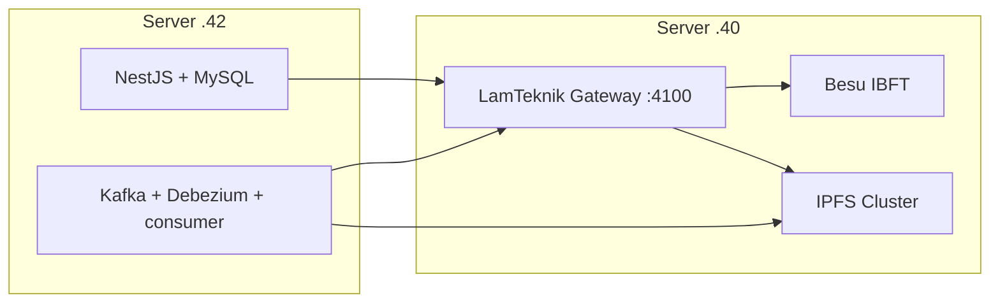

# LamTeknik System Revamp — Implementation Plan

Step-by-step plan to deploy the 2-VM layout described in [infrastructure.md](./infrastructure.md).

**Status:** Infra stack deploying on `.40` — app + CDC on `.42` pending.

**Last updated:** 2026-09-04

**Goal:** Server `.40` runs Besu + IPFS + open API gateway. Server `.42` runs app + CDC.

**VM runbook:** [vm-40-node-vault-plan.md](./vm-40-node-vault-plan.md)

---

## Outcomes

When complete:

1. Server `.40` runs Besu IBFT + IPFS Cluster + **LamTeknik Gateway** on `:4100` (no API key required).
2. Server `.42` runs LamTeknik app + **Kafka + Debezium + consumer** + MySQL.
3. Apps use `http://10.9.23.40:4100` (or nginx public URL) — no `x-api-key`.
4. CDC: `.42` MySQL → Kafka → consumer → gateway `.40` → Besu; files → IPFS on `.40`.

---

## Architecture summary



| Host | Runs |
|------|------|
| `10.9.23.40` | Besu + IPFS + Gateway — [vm-40-node-vault-plan.md](./vm-40-node-vault-plan.md) |
| `10.9.23.42` | MySQL, NestJS, web, Kafka, Debezium, consumer |

---

## Gateway — dev mode

| Setting | Value |
|---------|-------|
| Port | `:4100` |
| Auth | `API_KEY_REQUIRED=false` |
| Public access | nginx reverse proxy *(external)* |
| Signing | Gateway holds `DEPLOYER_PRIVATE_KEY` |

### API surface (no auth in dev)

| Method | Path |
|--------|------|
| `GET` | `/health` |
| `GET` | `/lamteknik`, `/lamteknik/{entity}/...` |
| `POST` | `/lamteknik/{entity}` |
| `POST` | `/ipfs/upload` |
| `GET` | `/ipfs/:cid` |

Optional auth via `API_KEY_REQUIRED=true` + `keys.json` remains available for production hardening.

---

## Phase 1 — Infra stack (VM `.40`)

> **Full runbook:** [vm-40-node-vault-plan.md](./vm-40-node-vault-plan.md)

1. Besu IBFT (`backend/blockchain-besu-ibft/docker`)
2. IPFS cluster (`backend/ipfs-cluster-private`)
3. Deploy contracts (`npm run deploy:lamteknik` via Docker)
4. Gateway container (`API/docker compose up -d --build`)

**Deliverable:** Gateway healthy on `:4100`; contracts deployed; IPFS cluster up.

---

## Phase 2 — App + CDC (VM `.42`)

```env
API_ENDPOINT=http://10.9.23.40:4100
API_KEY=
IPFS_CLUSTER_REST_URL=http://10.9.23.40:9094
```

**Deliverable:** CDC end-to-end through gateway on `.40`; files to IPFS on `.40`.

---

## Phase 3 — Integration testing

1. Gateway health on `.40:4100`
2. Entity read/write without API key
3. CDC row change → on-chain verify via `.40:4100`
4. IPFS file column via `.40:9094` or gateway `/ipfs/upload`
5. Cross-VM test from `.42`

---

## Implementation checklist

| # | Task | Host | Status |
|---|------|------|--------|
| 1 | Besu up | `.40` | ✅ |
| 2 | IPFS cluster up | `.40` | ✅ |
| 3 | Contracts deployed | `.40` | ✅ |
| 4 | Gateway Docker on `.40` | `.40` | ✅ |
| 5 | Gateway code | `API/` | ✅ |
| 6 | App + CDC on `.42` | `.42` | ☐ |
| 7 | End-to-end smoke test | all | ☐ |

---

## Decisions log

| Date | Decision |
|------|----------|
| 2026-09-04 | **Unified `.40`:** Besu + IPFS + Gateway on one VM; open dev API; no ufw |
| 2026-09-04 | **Deprecated `.41`:** IPFS vault split removed for simplicity |
| 2026-09-03 | Custom Express gateway; Kong rejected |
| 2026-09-03 | Topology split `.40`/`.41` *(superseded 2026-09-04)* |

---

## References

- [infrastructure.md](./infrastructure.md)
- [vm-40-node-vault-plan.md](./vm-40-node-vault-plan.md)
- [`API/command/how-to-blockchain-api.md`](../API/command/how-to-blockchain-api.md)
- [`API/command/how-to-ipfs-api.md`](../API/command/how-to-ipfs-api.md)
