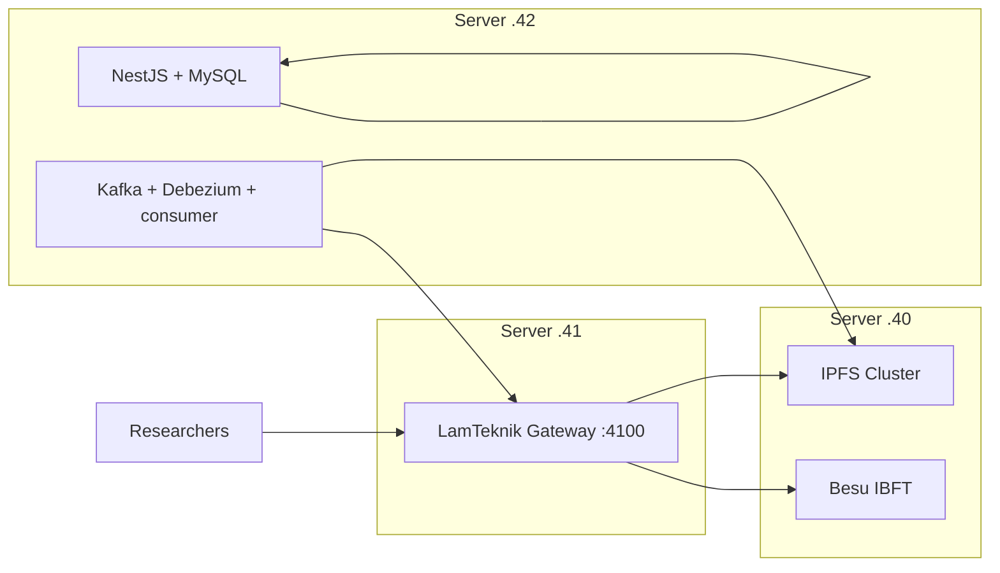

# LamTeknik System Revamp — Implementation Plan

Step-by-step plan to deploy the multi-VM layout described in [infrastructure.md](./infrastructure.md).

**Status:** Gateway code implemented — VM deployment pending.

**Last updated:** 2026-09-03

**Goal:** All production work runs **on VMs** — not local Docker. Servers `.40` (nodes), `.41` (Express BAF gateway), `.42` (app + CDC).

**VM runbooks (execute in order):**

- [vm-40-node-vault-plan.md](./vm-40-node-vault-plan.md) — Besu + IPFS on `10.9.23.40`
- [vm-41-gateway-plan.md](./vm-41-gateway-plan.md) — LamTeknik Gateway on `10.9.23.41`

---

## Outcomes

When complete:

1. Server `.40` runs Besu + IPFS only, firewalled to `.41` + `.42`.
2. Server `.41` runs the **LamTeknik Gateway** (single Docker container on `:4100`).
3. Server `.42` runs LamTeknik app + **Kafka + Debezium + consumer** + MySQL.
4. Researchers use `http://10.9.23.41:4100` + `x-api-key`.
5. CDC: `.42` MySQL → Kafka → consumer → gateway `.41` → Besu `.40`; files → IPFS `.40` direct.

---

## Architecture summary



| Host | Runs |
|------|------|
| `10.9.23.40` | Besu + IPFS — [vm-40-node-vault-plan.md](./vm-40-node-vault-plan.md) |
| `10.9.23.41` | LamTeknik Gateway only — [vm-41-gateway-plan.md](./vm-41-gateway-plan.md) |
| `10.9.23.42` | MySQL, NestJS, web, Kafka, Debezium, consumer |

---

## Blockchain API Gateway — what we use

The gateway is a **custom LamTeknik Gateway** (Express BAF) extending [`API/server-lamteknik.js`](../API/server-lamteknik.js).

| Decision | Choice |
|----------|--------|
| **Gateway product** | Custom Express + ethers.js (`server-lamteknik.js`) |
| **Rejected** | FireFly, Kong, raw JSON-RPC passthrough, EthConnect (route shape mismatch) |
| **Pattern** | Blockchain Application Firewall — `x-api-key` + `allowedEntities[]` |
| **Host** | Server `10.9.23.41` only |
| **Port** | `:4100`; optional Caddy HTTPS → `:4100` |

### Gateway technology stack

| Layer | Technology | Role |
|-------|------------|------|
| HTTP server | Express.js | REST API, auth middleware, IPFS proxy |
| Blockchain client | ethers.js v6 | Besu reads/writes, custodial signing |
| Auth | `x-api-key` + `keys.json` | Per-key `role`, `allowedEntities[]` |
| Signing | Queue + atomic nonce | Serializes concurrent CDC/researcher writes |
| Container | Docker | Deploy on `.41` |

### Research validation (2026-09-03)

| Source | Validates |
|--------|-----------|
| Oracle OBP Besu RPC Proxy | Authenticated REST layer; never expose raw RPC |
| Cardoso et al. 2025 (LADC) | Custom Node.js gateway + nonce management for Besu |
| BAF paper (Delgado-von-Eitzen et al.) | Application-level firewall in front of Besu |
| EthConnect / Kaleido | REST bridge pattern — we extend custom gateway for CDC envelope |

### Gateway — implemented vs VM deploy

#### Implemented

- [`API/server-lamteknik.js`](../API/server-lamteknik.js) — entity routes, auth, signing queue, IPFS proxy, deploy route
- [`API/Dockerfile`](../API/Dockerfile), [`API/docker-compose.yml`](../API/docker-compose.yml)
- [`API/keys.json.example`](../API/keys.json.example)
- [`API/command/how-to-ipfs-api.md`](../API/command/how-to-ipfs-api.md)

#### VM deploy pending

| # | Work item | Host |
|---|-----------|------|
| 1 | Besu + IPFS + ufw | `.40` |
| 2 | Deploy contracts | `.40` / `.41` |
| 3 | Gateway container + `keys.json` | `.41` |
| 4 | App + CDC stack | `.42` |
| 5 | End-to-end smoke test | all |

### Gateway API surface

| Method | Path | Auth |
|--------|------|------|
| `GET` | `/health` | None |
| `GET` | `/lamteknik`, `/lamteknik/{entity}/...` | `x-api-key` |
| `POST` | `/lamteknik/{entity}` | `x-api-key` (gateway signs) |
| `POST` | `/deploy/lamteknik` | Admin key only |
| `POST` | `/ipfs/upload` | `x-api-key` |
| `GET` | `/ipfs/:cid` | `x-api-key` |

### API key profiles (`keys.json`)

```json
{
  "keys": [
    {
      "key": "sk-lamtek-cdc-internal",
      "label": "CDC consumer",
      "role": "admin",
      "allowedEntities": ["*"]
    },
    {
      "key": "sk-lamtek-research-xxxx",
      "label": "Researcher",
      "role": "researcher",
      "allowedEntities": ["akreditasi", "user", "prodi"]
    }
  ]
}
```

**Future Fabric:** add `"backend": "fabric"` per key when Fabric network exists — not implemented now.

### Security model

| Actor | Auth | Reaches |
|-------|------|---------|
| Researcher | `x-api-key` | `/lamteknik/*`, `/ipfs/*` on `.41`; entity-scoped |
| CDC consumer | Internal admin key | Gateway `.41:4100` + IPFS `.40:9094` direct |
| Admin | Admin key | + `POST /deploy/lamteknik` |
| Node ops | SSH only | `keys.json`, Besu/IPFS on `.40` |

---

## Phase 0 — Prerequisites

| Item | Action |
|------|--------|
| Servers | `.40`, `.41`, `.42` provisioned |
| Git | Clone repo on each VM |
| Secrets | Besu/IPFS secrets on `.40`; gateway `.env` + `keys.json` on `.41` |
| Network | `.41` + `.42` in `.40` ufw |

---

## Phase 1 — Node vault (VM `.40`)

> **Full runbook:** [vm-40-node-vault-plan.md](./vm-40-node-vault-plan.md)

Besu IBFT, IPFS Cluster, port bind fix, ufw, contract deploy.

**Deliverable:** `.40` nodes healthy; artifacts on `.41`.

---

## Phase 2 — LamTeknik Gateway (VM `.41`)

> **Full runbook:** [vm-41-gateway-plan.md](./vm-41-gateway-plan.md)

```bash
cd API
cp keys.json.example keys.json   # edit keys
cp .env.example .env             # edit secrets
docker compose up -d --build
curl http://10.9.23.41:4100/health
```

**Deliverable:** Gateway healthy; researcher + CDC key tests pass.

---

## Phase 3 — App + CDC (VM `.42`)

```env
API_ENDPOINT=http://10.9.23.41:4100
API_KEY=sk-lamtek-cdc-internal
IPFS_CLUSTER_REST_URL=http://10.9.23.40:9094
```

**Deliverable:** CDC end-to-end through gateway.

---

## Phase 4 — Integration testing

1. Gateway health + auth (401 without key)
2. Researcher entity scope (403 on disallowed entity)
3. CDC row change → on-chain verify
4. IPFS file column via direct `.40:9094`
5. Admin deploy via `POST /deploy/lamteknik`

---

## Phase 5 — Hardening (optional)

| Task | Detail |
|------|--------|
| HTTPS | Caddy → `:4100` |
| Audit log | `AUDIT_LOG_ENABLED=true` |
| Rate limits | `express-rate-limit` per key |
| Monitoring | Prometheus scrape `/health` |

---

## Implementation checklist

| # | Task | Host | Status |
|---|------|------|--------|
| 1 | Besu + IPFS up | `.40` | ☐ |
| 2 | IPFS ports + ufw | `.40` | ☐ |
| 3 | Contracts deployed | `.40` / `API` | ☐ |
| 4 | Gateway code (auth, queue, IPFS) | `API/` | ✅ |
| 5 | Gateway Docker on `.41` | `.41` | ☐ |
| 6 | App + CDC on `.42` | `.42` | ☐ |
| 7 | End-to-end smoke test | all | ☐ |

---

## Decisions log

| Date | Decision |
|------|----------|
| 2026-08-11 | Drop Hyperledger FireFly |
| 2026-08-11 | Server `.40` = nodes; Server `.41` = gateway |
| 2026-08-11 | CDC co-located with MySQL |
| 2026-09-03 | Custom Express gateway confirmed |
| 2026-09-03 | **Drop Kong** — Express handles `x-api-key` directly; SSH + `keys.json` for key admin |
| 2026-09-03 | Signing queue + nonce manager required (Cardoso 2025, EthConnect pattern) |
| 2026-09-03 | No raw JSON-RPC passthrough; entity REST only (BAF pattern) |
| 2026-09-03 | Fabric multi-backend deferred; Besu-only now |
| 2026-09-03 | Deploy via API = admin keys only; node ops = SSH only |

---

## References

- [infrastructure.md](./infrastructure.md)
- [vm-41-gateway-plan.md](./vm-41-gateway-plan.md)
- [`API/command/how-to-blockchain-api.md`](../API/command/how-to-blockchain-api.md)
- [`API/command/how-to-ipfs-api.md`](../API/command/how-to-ipfs-api.md)
