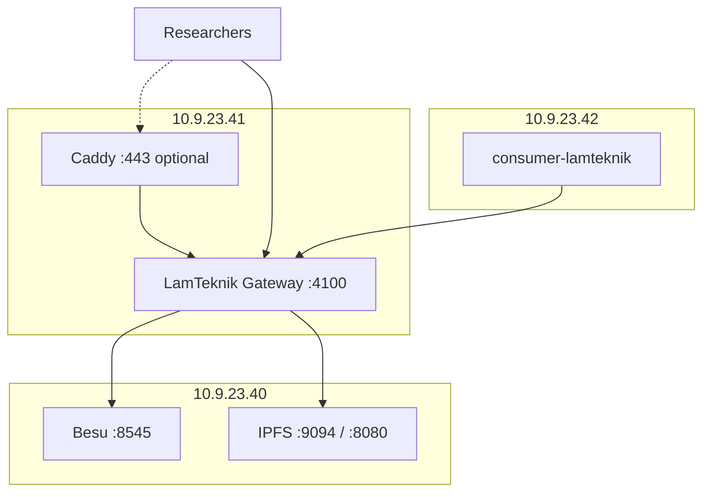

# VM `.41` — Gateway Implementation Plan

**Host:** `10.9.23.41`  
**Role:** LamTeknik Gateway (Express BAF) — single container on `:4100`  
**Status:** Gateway code implemented — deploy on VM when ready  
**Last updated:** 2026-09-03

**Related:** [infrastructure.md](./infrastructure.md) · [vm-40-node-vault-plan.md](./vm-40-node-vault-plan.md) · [revamp-system-plan.md](./revamp-system-plan.md)

**Depends on:** VM `.40` Phases 1–6 complete (Besu, IPFS, ufw, contracts deployed, artifacts copied here).

---

## Purpose

Server `.41` is the **only front door** for blockchain and IPFS API access:

| Actor | Auth | Entry |
|-------|------|-------|
| Researchers | `x-api-key` | `http://10.9.23.41:4100/lamteknik/*`, `/ipfs/*` |
| CDC consumer (VM `.42`) | Internal admin `x-api-key` | `http://10.9.23.41:4100/lamteknik/*` |
| Admin (deploy) | Admin `x-api-key` (`role: admin`) | `POST /deploy/lamteknik` |
| Node ops | SSH only | Edit `keys.json`, Besu/IPFS management on `.40` |

Raw Besu (`:8545`) and IPFS Cluster (`:9094`) URLs are **never** handed to external users. No Kong, no public admin UI.

---

## Architecture on this VM



---

## Prerequisites

| Item | Action |
|------|--------|
| VM `.40` | Besu + IPFS healthy; ufw allows `.41` |
| Artifacts | `API/build/contracts/lamteknik/` + `lamteknik-deployments.json` on this VM |
| Docker | Docker Engine + Compose v2 |
| Git | Clone `lamteknik-blockchain` |
| Secrets | `DEPLOYER_PRIVATE_KEY` for gateway signer (not shared with researchers) |
| Keys | Copy `API/keys.json.example` → `keys.json`; set production keys |

---

## Phase 1 — Provision and clone

```bash
cd ~
git clone <repo-url> lamteknik-blockchain
cd lamteknik-blockchain
docker --version && docker compose version
```

**Deliverable:** Repo on `.41`, Docker ready.

---

## Phase 2 — Gateway configuration

### 2.1 Environment

Create `API/.env` on `.41`:

```env
LAMTEKNIK_PORT=4100
BLOCKCHAIN_RPC_URL=http://10.9.23.40:8545
CHAIN_ID=1337
DEPLOYER_PRIVATE_KEY=<gateway signer — keep secret>
IPFS_CLUSTER_REST_URL=http://10.9.23.40:9094
IPFS_GATEWAY_URL=http://10.9.23.40:8080
CORS_ORIGIN=*
API_KEY_REQUIRED=true
API_KEYS_FILE=/app/keys.json
AUDIT_LOG_ENABLED=true
```

### 2.2 API keys

Copy and edit keys:

```bash
cp API/keys.json.example API/keys.json
# Edit: set sk-lamtek-cdc-internal, researcher keys, admin deploy key
```

Key profiles in `keys.json`:

| Field | Meaning |
|-------|---------|
| `key` | Secret sent as `x-api-key` header |
| `label` | Human-readable name (audit logs) |
| `role` | `researcher` or `admin` |
| `allowedEntities` | Entity slugs or `["*"]` for all |

Admin workflow (SSH):

1. SSH to `.41`
2. Edit `keys.json`
3. `docker compose restart` in `API/`
4. Hand researcher a profile sheet

**Deliverable:** `keys.json` and `.env` on VM, not committed to git.

---

## Phase 3 — Deploy gateway container

```bash
cd ~/lamteknik-blockchain/API
docker compose up -d --build
```

### 3.1 Smoke tests (on `.41`)

```bash
curl -s http://127.0.0.1:4100/health | jq .
curl -s -H "x-api-key: sk-lamtek-cdc-internal" \
  http://127.0.0.1:4100/lamteknik/akreditasi/count
curl -s -H "x-api-key: sk-lamtek-research-dev" \
  http://127.0.0.1:4100/lamteknik | jq '.totalEntities'
```

Without key (when `API_KEY_REQUIRED=true`):

```bash
curl -s http://127.0.0.1:4100/lamteknik
# → 401
```

**Deliverable:** Gateway healthy on `:4100`.

---

## Phase 4 — Firewall on `.41`

```bash
sudo ufw default deny incoming
sudo ufw default allow outgoing
sudo ufw allow from 10.9.23.0/24 to any port 22
sudo ufw allow from 10.9.23.42 to any port 4100
sudo ufw allow from <RESEARCHER_NETWORK> to any port 4100
sudo ufw enable
```

Gateway talks **outbound** to `.40` — ensure `.40` ufw already allows `.41`.

---

## Phase 5 — Wire CDC from VM `.42`

On **`.42`**, set in `connection/consumer-lamteknik/.env.local`:

```env
API_ENDPOINT=http://10.9.23.41:4100
API_KEY=sk-lamtek-cdc-internal
IPFS_CLUSTER_REST_URL=http://10.9.23.40:9094
```

Consumer sends `x-api-key` header; gateway signs with `DEPLOYER_PRIVATE_KEY` (no `privateKey` in POST body).

**Deliverable:** Row change on `.42` → consumer → gateway `.41` → Besu `.40`.

---

## Phase 6 — Integration tests

| # | Test | Command / action |
|---|------|------------------|
| 1 | Gateway health | `curl http://10.9.23.41:4100/health` |
| 2 | Entity list with key | `curl -H "x-api-key: ..." http://10.9.23.41:4100/lamteknik` |
| 3 | Researcher entity scope | POST to allowed entity OK; forbidden entity → 403 |
| 4 | CDC write | Update row on `.42`; check consumer logs + on-chain GET |
| 5 | IPFS via gateway | `POST /ipfs/upload` with researcher key |
| 6 | Admin deploy | `POST /deploy/lamteknik` with admin key only |
| 7 | No key | Requests without key → 401 |

Document results in [`progress-tracker.md`](./progress-tracker.md).

---

## Phase 7 — Optional hardening

| Task | Detail |
|------|--------|
| HTTPS | Caddy on `.41` → `reverse_proxy localhost:4100` |
| Rate limits | `express-rate-limit` per key (future) |
| Secrets | `DEPLOYER_PRIVATE_KEY` outside git; rotate keys via `keys.json` |
| Audit log | Set `AUDIT_LOG_ENABLED=true` — logs key label, entity, tx hash |
| Monitoring | Scrape `GET /health` |

---

## Gateway API surface

| Method | Path | Auth |
|--------|------|------|
| `GET` | `/health` | None |
| `GET` | `/lamteknik` | `x-api-key` |
| `GET` | `/lamteknik/{entity}/...` | `x-api-key` + entity scope |
| `POST` | `/lamteknik/{entity}` | `x-api-key` + entity scope (CDC envelope) |
| `POST` | `/deploy/lamteknik` | Admin key only |
| `POST` | `/ipfs/upload` | `x-api-key` |
| `GET` | `/ipfs/:cid` | `x-api-key` |

Example researcher profile:

```
Base URL:   http://10.9.23.41:4100
API key:    sk-lamtek-research-xxxx
Entities:   akreditasi, user, prodi

Read:   GET  /lamteknik/akreditasi/count
Write:  POST /lamteknik/akreditasi
IPFS:   POST /ipfs/upload   GET /ipfs/{cid}
```

---

## VM `.41` checklist

| # | Task | Status |
|---|------|--------|
| 1 | Repo + Docker on `.41` | ☐ |
| 2 | Contract artifacts under `API/build/` | ☐ |
| 3 | `Dockerfile` + `docker-compose.yml` | ✅ |
| 4 | Gateway: auth, signing queue, IPFS, deploy | ✅ |
| 5 | `keys.json` configured | ☐ |
| 6 | Gateway container up on `:4100` | ☐ |
| 7 | ufw rules applied | ☐ |
| 8 | Researcher key test | ☐ |
| 9 | CDC from `.42` end-to-end | ☐ |

---

## Files on this VM

| Path | Action |
|------|--------|
| `API/Dockerfile` | ✅ Created |
| `API/docker-compose.yml` | ✅ Created |
| `API/server-lamteknik.js` | ✅ Auth, signing queue, IPFS, deploy |
| `API/keys.json` | Create from example — not in git |
| `API/.env` | VM-specific secrets |
| `API/build/contracts/lamteknik/` | Volume mount from deploy host |

---

## Startup order (`.41`)

1. Confirm `.40` nodes + ufw + contracts  
2. Configure `.env` and `keys.json`  
3. `docker compose up -d --build`  
4. Apply ufw  
5. Run integration tests with `.42` CDC  

**Previous VM:** [vm-40-node-vault-plan.md](./vm-40-node-vault-plan.md)
