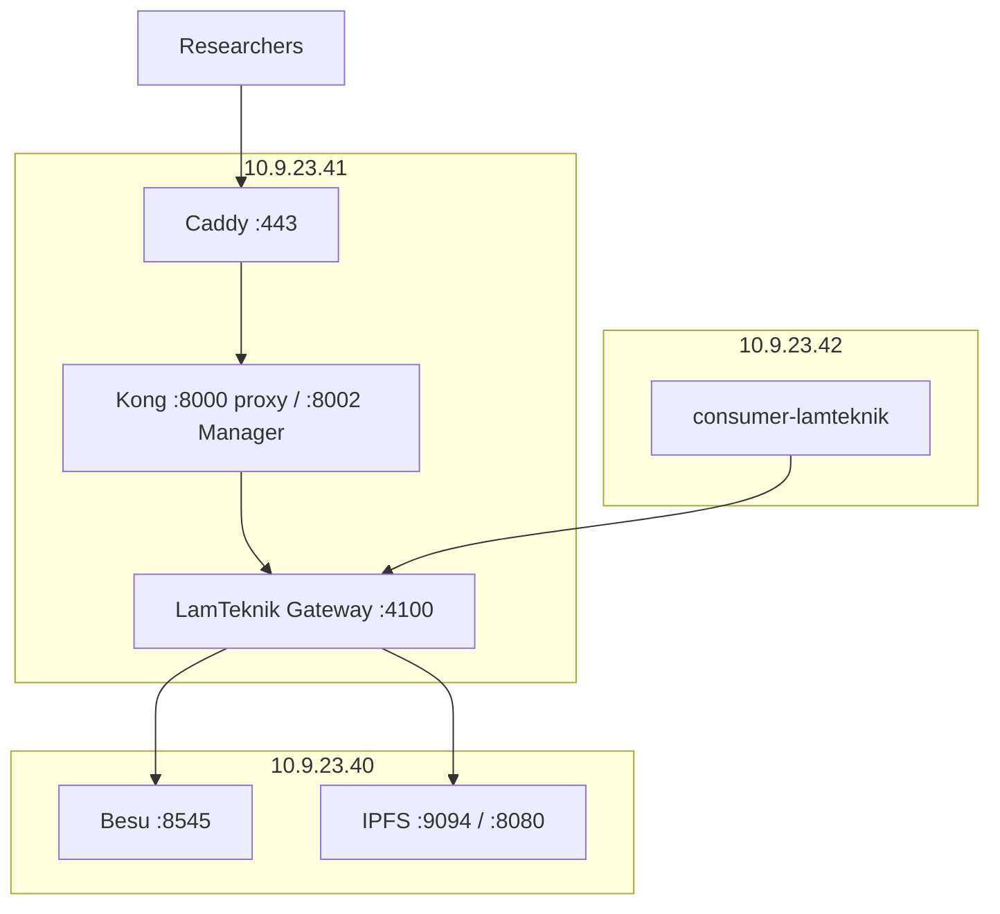

# VM `.41` — Gateway Implementation Plan

**Host:** `10.9.23.41`  
**Role:** LamTeknik Gateway + Kong API management + HTTPS front door  
**Status:** Planned — execute on the VM (not local Docker)  
**Last updated:** 2026-09-03

**Related:** [infrastructure.md](./infrastructure.md) · [vm-40-node-vault-plan.md](./vm-40-node-vault-plan.md) · [revamp-system-plan.md](./revamp-system-plan.md)

**Depends on:** VM `.40` Phases 1–6 complete (Besu, IPFS, ufw, contracts deployed, artifacts copied here).

---

## Purpose

Server `.41` is the **only front door** for blockchain and IPFS access:

| Actor | Auth | Entry |
|-------|------|-------|
| Researchers | `x-api-key` via Kong | `https://<gateway>/v1/...` |
| CDC consumer (VM `.42`) | Internal API key | `http://10.9.23.41:4100/lamteknik/*` or via Kong internal consumer |
| Admin | SSH + Kong Manager | Key CRUD, rate limits |
| Public internet | Blocked from `.40` | Gateway terminates TLS here |

Raw Besu (`:8545`) and IPFS Cluster (`:9094`) URLs are **never** handed to external users.

---

## Architecture on this VM



---

## Prerequisites

| Item | Action |
|------|--------|
| VM `.40` | Besu + IPFS healthy; ufw allows `.41` |
| Artifacts | `API/build/contracts/lamteknik/` + `lamteknik-deployments.json` on this VM |
| Docker | Docker Engine + Compose v2 |
| Git | Clone `lamteknik-blockchain` |
| Secrets | `DEPLOYER_PRIVATE_KEY` for gateway signer (not shared with researchers) |
| DNS (optional) | Hostname for Caddy/Let's Encrypt, or use IP + self-signed for pilot |

---

## Phase 1 — Provision and clone

```bash
cd ~
git clone <repo-url> lamteknik-blockchain
cd lamteknik-blockchain
docker --version && docker compose version
```

**Deliverable:** Repo on `.41`, Docker ready.

---

## Phase 2 — Gateway application (code changes before deploy)

These changes are made in the repo (on `.41` after clone, or pushed from dev machine). Required before containerizing.

### 2.1 Create container files

| File | Purpose |
|------|---------|
| `API/Dockerfile` | Node 22, `npm ci`, `node server-lamteknik.js` |
| `API/docker-compose.yml` | Service on `:4100`; volume `build/contracts/lamteknik/` |
| `API/.env` | Cross-VM config (see Phase 3) |

### 2.2 Extend `server-lamteknik.js`

| # | Feature | Why |
|---|---------|-----|
| 1 | **Signing queue** | Serialize txs from one `DEPLOYER_PRIVATE_KEY` (CDC runs concurrent writes) |
| 2 | **Strip `privateKey` from POST body** | Researchers must not supply Besu keys |
| 3 | **`x-api-key` middleware** | Entity scope via `allowedEntities[]` (Express layer; Kong also auth's) |
| 4 | **`/v1` prefix** | Alias `/v1/lamteknik/*` and `/v1/ipfs/*` |
| 5 | **IPFS proxy routes** | `POST /v1/ipfs/upload`, `GET /v1/ipfs/:cid`, metadata |
| 6 | **Admin ops routes** | `GET /admin/chain/status`, `GET /admin/ipfs/pins`, etc. — IP-restrict to admin |
| 7 | **`GET /health`** | No key required; include `contractsLoaded: 26` |

Reference: [`API/command/how-to-blockchain-api.md`](../API/command/how-to-blockchain-api.md), [`API/command/how-to-ipfs-api.md`](../API/command/how-to-ipfs-api.md) (complete TODO).

**Deliverable:** Gateway code ready to build image.

---

## Phase 3 — Gateway environment

Create `API/.env` on `.41`:

```env
LAMTEKNIK_PORT=4100
BLOCKCHAIN_RPC_URL=http://10.9.23.40:8545
CHAIN_ID=1337
DEPLOYER_PRIVATE_KEY=<gateway signer — keep secret>
IPFS_CLUSTER_REST_URL=http://10.9.23.40:9094
IPFS_GATEWAY_URL=http://10.9.23.40:8080
CORS_ORIGIN=*

# Auth
API_KEY_REQUIRED=true
INTERNAL_API_KEY=sk-lamtek-cdc-internal-<random>
# Optional file store if not using Kong for CDC path:
# API_KEYS_FILE=/app/keys.json
```

**Deliverable:** `.env` on VM, not committed to git.

---

## Phase 4 — Deploy LamTeknik Gateway container

```bash
cd ~/lamteknik-blockchain/API
docker compose up -d --build
```

### 4.1 Smoke tests (on `.41`)

```bash
curl -s http://127.0.0.1:4100/health | jq .
curl -s http://127.0.0.1:4100/lamteknik | jq '.totalEntities'
curl -s -H "x-api-key: $INTERNAL_API_KEY" \
  http://127.0.0.1:4100/lamteknik/akreditasi/count
```

Expect `contractsLoaded: 26` and successful count with internal key.

**Deliverable:** Gateway healthy on `:4100`.

---

## Phase 5 — Kong OSS + Kong Manager

Kong provides **API key administration** (your chosen admin UI) and rate limiting.

### 5.1 Deploy Kong stack

Add `API/kong/docker-compose.yml` (or top-level `gateway/` compose) with:

| Service | Ports | Notes |
|---------|-------|-------|
| Kong proxy | `8000`, `8443` | Public API entry (behind Caddy) |
| Kong Manager | `8002` | Admin GUI — restrict to admin IP |
| PostgreSQL or DB-less | — | Kong 3.x supports declarative DB-less mode for pilot |

### 5.2 Kong configuration

| Object | Config |
|--------|--------|
| **Upstream** | `lamteknik-gateway:4100` (Docker network) |
| **Service** | Points to upstream |
| **Route `/v1`** | Path prefix `/v1` → gateway (strip or pass-through to match Express routes) |
| **Plugin `key-auth`** | `key_names: [x-api-key]` |
| **Plugin `rate-limiting`** | Per consumer, e.g. 100 req/min pilot |
| **Consumer `cdc-internal`** | Credential = `INTERNAL_API_KEY` from gateway `.env` |
| **Consumer `researcher-*`** | One per researcher profile |

Context7 reference: Kong `key-auth` uses `key_names` — default is `apikey`; must set `x-api-key` explicitly.

### 5.3 Kong Manager workflow

1. Open `http://10.9.23.41:8002` (admin network only)  
2. Create Service → Upstream `http://lamteknik-gateway:4100`  
3. Add Route `/v1`  
4. Enable `key-auth` + `rate-limiting` on Service  
5. Create Consumers; add `key-auth` credentials (`sk-lamtek-research-xxxx`)  
6. Hand researchers a profile sheet (base URL + key + allowed entities doc)

**Deliverable:** Researcher POST/GET fails without key; succeeds with valid Kong credential.

---

## Phase 6 — HTTPS (Caddy)

Move HTTPS from “optional Phase 5” to **required before external researchers**.

```bash
# Example Caddyfile on .41
lamtek.example.com {
  reverse_proxy localhost:8000
}
```

Or for IP-only pilot:

```
:443 {
  tls internal
  reverse_proxy localhost:8000
}
```

**Deliverable:** `https://<host>/v1/lamteknik/akreditasi/count` works with `x-api-key`.

---

## Phase 7 — Firewall on `.41`

```bash
sudo ufw default deny incoming
sudo ufw default allow outgoing
sudo ufw allow from 10.9.23.0/24 to any port 22
sudo ufw allow 443/tcp    # researchers (adjust source if possible)
sudo ufw allow from 10.9.23.42 to any port 4100   # CDC direct to gateway
sudo ufw allow from <ADMIN_IP> to any port 8002   # Kong Manager
sudo ufw enable
```

Gateway talks **outbound** to `.40` — ensure `.40` ufw already allows `.41`.

**Deliverable:** `.42` reaches `:4100`; researchers reach `:443`; admin reaches Kong Manager.

---

## Phase 8 — Wire CDC from VM `.42`

On **`.42`** (separate VM plan — not this file), set:

```env
API_ENDPOINT=http://10.9.23.41:4100
# Or via Kong: http://10.9.23.41:8000 with path prefix
IPFS_CLUSTER_REST_URL=http://10.9.23.40:9094
```

Update [`connection/consumer-lamteknik/server.js`](../connection/consumer-lamteknik/server.js) to send:

```http
x-api-key: <INTERNAL_API_KEY or Kong cdc-internal credential>
```

Remove `privateKey` from POST body when gateway signs.

**Deliverable:** Row change on `.42` → consumer → gateway `.41` → Besu `.40`.

---

## Phase 9 — Integration tests (from `.41` or `.42`)

| # | Test | Command / action |
|---|------|------------------|
| 1 | Gateway health | `curl http://10.9.23.41:4100/health` |
| 2 | Entity list | `curl -H "x-api-key: ..." http://10.9.23.41:4100/lamteknik` |
| 3 | Researcher via HTTPS | `curl -H "x-api-key: sk-test" https://<host>/v1/lamteknik/akreditasi/count` |
| 4 | CDC write | Update row on `.42`; check consumer logs + on-chain GET |
| 5 | IPFS via gateway | `POST /v1/ipfs/upload` with researcher key |
| 6 | IPFS direct CDC | Consumer logs `[IPFS]` → CID on `.40:9094` |
| 7 | Admin ops | `GET /admin/chain/status` from admin IP only |

Document results in [`progress-tracker.md`](./progress-tracker.md).

---

## Phase 10 — Hardening

| Task | Detail |
|------|--------|
| Secrets | `DEPLOYER_PRIVATE_KEY` in env file outside git; rotate API keys via Kong |
| Rate limits | Tune Kong `rate-limiting` per researcher |
| Entity scope | Express middleware: reject POST to entities not in key profile |
| Monitoring | Optional Prometheus scrape gateway `/health` + Kong metrics |
| Logs | Structured request logs: key id, entity, tx hash (never log private keys) |

---

## Gateway API surface (researcher-facing)

| Method | Path | Auth |
|--------|------|------|
| `GET` | `/health` | None |
| `GET` | `/v1/lamteknik` | `x-api-key` |
| `GET` | `/v1/lamteknik/{entity}/...` | `x-api-key` |
| `POST` | `/v1/lamteknik/{entity}` | `x-api-key` (CDC envelope) |
| `POST` | `/v1/ipfs/upload` | `x-api-key` |
| `GET` | `/v1/ipfs/{cid}` | `x-api-key` |

Example profile for a researcher:

```
Base URL:   https://lamtek.example/v1
API key:    sk-lamtek-research-xxxx
Entities:   akreditasi, user, prodi, ...
IPFS:       POST /v1/ipfs/upload   GET /v1/ipfs/{cid}
```

---

## VM `.41` checklist

| # | Task | Status |
|---|------|--------|
| 1 | Repo + Docker on `.41` | ☐ |
| 2 | Contract artifacts present under `API/build/` | ☐ |
| 3 | `Dockerfile` + `docker-compose.yml` for gateway | ☐ |
| 4 | Gateway code: signing queue, auth, IPFS, `/v1`, admin ops | ☐ |
| 5 | Gateway container up on `:4100` | ☐ |
| 6 | Kong OSS + Manager configured | ☐ |
| 7 | Caddy HTTPS on `:443` | ☐ |
| 8 | ufw rules applied | ☐ |
| 9 | Researcher key test via HTTPS | ☐ |
| 10 | CDC from `.42` end-to-end | ☐ |

---

## Files to create or modify (this VM)

| Path | Action |
|------|--------|
| `API/Dockerfile` | Create |
| `API/docker-compose.yml` | Create |
| `API/server-lamteknik.js` | Signing queue, auth, IPFS, admin routes |
| `API/.env` | VM-specific secrets |
| `API/.env.example` | Document cross-VM vars |
| `API/kong/docker-compose.yml` | Kong stack (suggested path) |
| `API/command/how-to-ipfs-api.md` | Complete guide |
| Caddy config on VM | `/etc/caddy/Caddyfile` or compose |

---

## Startup order (`.41`)

1. Confirm `.40` nodes + ufw + contracts  
2. Build and start LamTeknik Gateway (`:4100`)  
3. Start Kong; configure upstream + plugins  
4. Start Caddy (HTTPS → Kong `:8000`)  
5. Apply ufw  
6. Run integration tests with `.42` CDC  

**Previous VM:** [vm-40-node-vault-plan.md](./vm-40-node-vault-plan.md)
