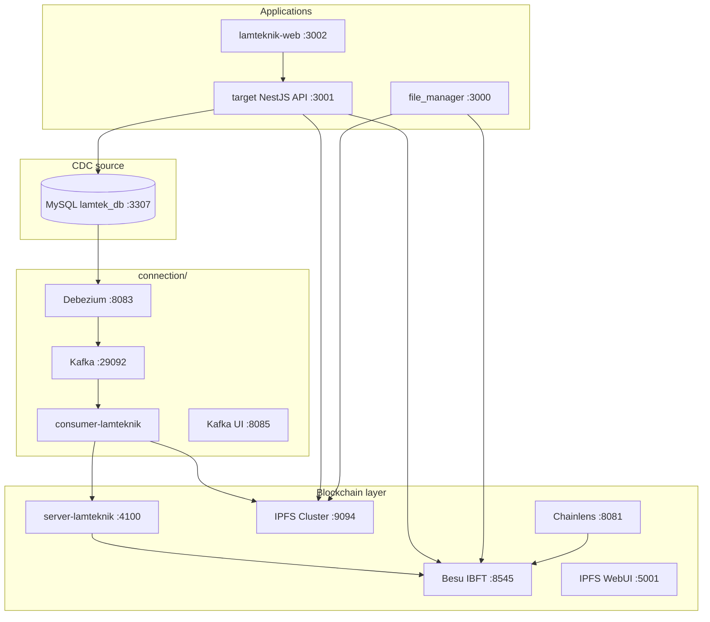

# Run All — LamTeknik CDC Stack

Developer guide for bringing up the **full system on a new machine or server**. Each layer has its own Docker Compose (or `npm` process). Start them in the order below.

For deeper detail per component, see the linked command docs in each folder.

---

## Architecture at a glance



**Two upload paths (by design):**

| App | Upload path | On-chain |
|---|---|---|
| **lamteknik-web** (dokumen page) | NestJS → Kubo `:5001` | Optional legacy contracts; CDC via Debezium for entity tables |
| **file_manager** | Next.js → IPFS Cluster `:9094` → `DocumentCertificate` on Besu | Direct server-side signing |
| **CDC (all watched tables)** | MySQL binlog → Kafka → consumer → API `:4100` → 26 `*Storage` contracts | Automatic on row change |

---

## Prerequisites

| Tool | Version / notes |
|---|---|
| **Git** | Clone this repository |
| **Docker Desktop** or **Docker Engine + Compose v2** | Required for Besu, IPFS, Kafka, target MySQL |
| **Node.js** | **≥ 22.10** for `API/` (see `API/package.json`); **≥ 18** for frontends and consumer |
| **npm** | Package installs for `API/`, `connection/consumer-lamteknik/`, `frontend/*`, optional local `target/backend` |
| **Disk** | ~10 GB+ for Docker images and node data |
| **OS** | Windows (PowerShell), macOS, or Linux |

**Recommended:** 16 GB RAM if running everything locally at once.

---

## Port reference

| Port | Service | Stack |
|---|---|---|
| 8545 | Besu RPC (Node-1) | `backend/blockchain-besu-ibft` |
| 8081 | **Chainlens** explorer UI | same compose |
| 5001 | IPFS Kubo API + **WebUI** | `backend/ipfs-cluster-private` |
| 8080 | IPFS gateway | same compose |
| 9094 | IPFS Cluster REST API | same compose |
| 29092 | Kafka (host) | `connection/kafka-debezium` |
| 8083 | Debezium Connect REST | same compose |
| 8085 | **Kafka UI** | same compose |
| 3307 | MySQL `lamtek_db` (binlog) | `target/` |
| 6379 | Redis | `target/` |
| 3001 | LamTeknik NestJS API | `target/` |
| 3002 | **lamteknik-web** frontend | `frontend/lamteknik-web` |
| 4100 | LamTeknik blockchain REST API | `API/` |
| 3000 | **file_manager** frontend | `frontend/file_manager` |
| 5432 | PostgreSQL (file_manager users) | separate Docker container |

---

## Startup order

Run these steps **sequentially** on first boot. Later restarts can often skip deploy/connector steps if data already exists.

| Step | Component | Required for |
|---|---|---|
| 1 | Besu IBFT + Chainlens | All blockchain writes |
| 2 | IPFS Cluster + WebUI | File uploads (both apps + CDC file columns) |
| 3 | Deploy contracts + blockchain API | CDC consumer + on-chain reads |
| 4 | Target stack (MySQL + NestJS) | lamteknik-web + CDC source DB |
| 5 | Kafka + Debezium + consumer | CDC pipeline |
| 6 | lamteknik-web frontend | Accreditation SaaS UI |
| 7 | file_manager (optional) | Standalone file demo |

---

## 1. Hyperledger Besu IBFT + Chainlens

**Path:** [`backend/blockchain-besu-ibft/docker/`](backend/blockchain-besu-ibft/docker/)

Includes **4 Besu validators** and **Chainlens** (Epirus) block explorer (MongoDB, Redis, API, web, ingestion, nginx).

```powershell
cd backend/blockchain-besu-ibft/docker
docker compose up -d
```

Wait until nodes are healthy:

```powershell
docker ps --filter "name=ibft-"
curl http://localhost:8545 -X POST -H "Content-Type: application/json" -d "{\"jsonrpc\":\"2.0\",\"method\":\"eth_blockNumber\",\"params\":[],\"id\":1}"
```

| URL | Purpose |
|---|---|
| http://localhost:8545 | JSON-RPC (used by API, consumer, apps) |
| http://localhost:8081 | **Chainlens** block explorer |

**Detail:** [`backend/blockchain-besu-ibft/command/run-besu-ibft.md`](backend/blockchain-besu-ibft/command/run-besu-ibft.md)

**Stop:**

```powershell
cd backend/blockchain-besu-ibft/docker
docker compose down
```

---

## 2. Private IPFS Cluster + WebUI

**Path:** [`backend/ipfs-cluster-private/`](backend/ipfs-cluster-private/)

4× Kubo + 4× IPFS Cluster on a **private swarm**. WebUI is imported offline on `ipfs0`.

### First-time setup (new machine only)

```powershell
cd backend/ipfs-cluster-private

# 1) Private swarm key
sh scripts/generate-swarm-key.sh
# PowerShell alternative — see run-ipfs-private.md

# 2) Cluster secret
"CLUSTER_SECRET=$(openssl rand -hex 32)" | Out-File .env -Encoding ascii
# Or copy from .env.example and edit

# 3) WebUI bundle (required for http://127.0.0.1:5001/webui)
sh scripts/download-webui-car.sh
```

### Start

```powershell
docker compose up -d
```

| URL | Purpose |
|---|---|
| http://127.0.0.1:5001/webui | **IPFS WebUI** (peers, pins, files) |
| http://127.0.0.1:8080 | IPFS gateway (browser previews) |
| http://127.0.0.1:9094 | Cluster REST API (CDC consumer + file_manager uploads) |

Verify:

```powershell
docker exec cluster0 ipfs-cluster-ctl peers ls
docker exec ipfs0 ipfs swarm peers
```

**Detail:** [`backend/ipfs-cluster-private/command/run-ipfs-private.md`](backend/ipfs-cluster-private/command/run-ipfs-private.md)

**Stop:** `docker compose down` (add `-v` only if you intend to wipe pinned data)

---

## 3. Smart contracts + blockchain API

**Path:** [`API/`](API/)

Connects to Besu on `:8545` and exposes REST routes for all 26 LamTeknik `*Storage` contracts. The **CDC consumer** calls this API — not Besu directly.

```powershell
cd API
npm install
copy .env.example .env

# Deploy all *Storage.sol contracts to local Besu
npm run deploy:lamteknik

# Start REST API (keep this terminal open)
npm run dev
```

| URL | Purpose |
|---|---|
| http://localhost:4100/health | Besu + contracts status |
| http://localhost:4100/lamteknik | List loaded entity slugs |

**Detail:** [`API/command/how-to-blockchain-api.md`](API/command/how-to-blockchain-api.md), [`API/command/how-to-smart-contract.md`](API/command/how-to-smart-contract.md)

---

## 4. LamTeknik source app (backend + database)

**Path:** [`target/`](target/)

NestJS API + MySQL (CDC source) + Redis. **Does not** bundle Besu, Kafka, or IPFS — it connects to the stacks above via `host.docker.internal`.

```powershell
cd target
docker compose up -d --build
```

First boot: TypeORM migrations + demo SQL seeds (10 akreditasi rows, test users).

| Service | Host port |
|---|---|
| MySQL (`lamtek_db`, binlog ROW) | **3307** |
| Redis | 6379 |
| NestJS API | **3001** |

Verify:

```powershell
curl http://localhost:3001/api/v1/health
```

**Demo login** (for lamteknik-web): `admin@lamtek.test` / `Test1234!`

**Detail:** [`target/command/run-target.md`](target/command/run-target.md)

---

## 5. Kafka, Debezium, CDC consumer

### 5a. Kafka + Debezium + Kafka UI (Docker)

**Path:** [`connection/kafka-debezium/`](connection/kafka-debezium/)

```powershell
cd connection/kafka-debezium
docker compose up -d
```

| URL | Purpose |
|---|---|
| http://localhost:8085 | **Kafka UI** (topics, connectors) |
| http://localhost:8083 | Debezium Connect REST |
| localhost:29092 | Kafka bootstrap (consumer) |

Verify: `curl http://localhost:8083/connectors`

**Detail:** [`connection/command/run-kafka-debezium.md`](connection/command/run-kafka-debezium.md)

### 5b. Configure consumer + register connector

**Path:** [`connection/consumer-lamteknik/`](connection/consumer-lamteknik/)

```powershell
cd connection/consumer-lamteknik
npm install

# First time: copy and edit env + table mapping
copy .env.example .env.local
copy config\table-mapping.example.json config\table-mapping.json
```

Key values for the **target** MySQL stack:

```env
CDC_DB_TYPE=mysql
DB_HOST=localhost
DB_PORT=3307
DB_USER=cdc_user
DB_PASSWORD=cdc_pass
DB_NAME=lamtek_db
API_ENDPOINT=http://127.0.0.1:4100
IPFS_CLUSTER_REST_URL=http://127.0.0.1:9094
TOPIC_PREFIX=lamteknik
```

Smoke tests:

```powershell
node utils/test-db-connection.js
node utils/add-lamteknik-connector.js
node utils/check-topics.js
```

### 5c. Start consumer (separate terminal)

```powershell
cd connection/consumer-lamteknik
node server.js
```

Expected: `[OK] Kafka connected`, topics like `lamteknik.lamtek_db.akreditasi`, then `Consumer ready. Waiting for CDC events...`

**CDC note:** Connector uses `snapshot.mode=never` — only **changes after** the connector starts are written to Besu. Update a row in MySQL or via the web UI to test.

**Detail:** [`connection/command/configure-cdc.md`](connection/command/configure-cdc.md), [`connection/command/run-kafka-consumer.md`](connection/command/run-kafka-consumer.md)

---

## 6. LamTeknik web app (frontend)

**Path:** [`frontend/lamteknik-web/`](frontend/lamteknik-web/)

Accreditation SaaS UI — talks to **target NestJS API** on `:3001`, not the blockchain API directly.

```powershell
cd frontend/lamteknik-web
copy .env.example .env.local
npm install
npm run dev
```

| URL | Purpose |
|---|---|
| http://localhost:3002 | **lamteknik-web** (login, dashboard, dokumen, master data) |
| http://localhost:3001/api/docs | NestJS Swagger |

**Env (`.env.local`):**

```env
NEXT_PUBLIC_API_URL=http://localhost:3001/api/v1
NEXT_PUBLIC_IPFS_GATEWAY=http://localhost:8080
```

**Dokumen upload:** use a valid akreditasi code from seed data, e.g. `AKR-2026-0001`.

---

## 7. File Manager app (optional)

**Path:** [`frontend/file_manager/`](frontend/file_manager/)

Standalone file-storage demo — **direct** IPFS Cluster + `DocumentCertificate` on Besu. Separate from lamteknik-web and CDC.

**Requires:** Besu (`:8545`), IPFS Cluster (`:9094`, gateway `:8080`), and its **own PostgreSQL** database.

### PostgreSQL (one-time)

```powershell
docker run --name fm-postgres `
  -e POSTGRES_PASSWORD=postgres `
  -e POSTGRES_DB=file_manager `
  -p 5432:5432 `
  -d postgres:16
```

### App setup

```powershell
cd frontend/file_manager
copy .env.example .env.local
npm install
npm run init:db
npm run deploy:contract
npm run dev
```

| URL | Purpose |
|---|---|
| http://localhost:3000 | **file_manager** UI |

**Detail:** [`frontend/file_manager/command/get-started.md`](frontend/file_manager/command/get-started.md)

---

## End-to-end verification checklist

Use this after a fresh bring-up:

| # | Check | Command / URL |
|---|---|---|
| 1 | Besu RPC | `curl` block number on `:8545` |
| 2 | Chainlens | http://localhost:8081 |
| 3 | IPFS WebUI | http://127.0.0.1:5001/webui |
| 4 | Blockchain API | http://localhost:4100/health → `contractsLoaded > 0` |
| 5 | Target API | http://localhost:3001/api/v1/health |
| 6 | lamteknik-web login | http://localhost:3002/login |
| 7 | Kafka UI | http://localhost:8085 → topics `lamteknik.lamtek_db.*` |
| 8 | CDC smoke test | Update a row in `akreditasi` → consumer log → `GET http://localhost:4100/lamteknik/akreditasi/{id}` |
| 9 | file_manager (optional) | Sign up at http://localhost:3000, upload a file |

---

## Stopping everything

Run from each directory (order does not matter for shutdown):

```powershell
# Apps (Ctrl+C in their terminals, or kill node processes)

cd frontend/lamteknik-web          # stop npm run dev
cd frontend/file_manager           # stop npm run dev
cd connection/consumer-lamteknik     # stop node server.js
cd API                               # stop npm run dev

cd connection/kafka-debezium && docker compose down
cd target && docker compose down
cd backend/ipfs-cluster-private && docker compose down
cd backend/blockchain-besu-ibft/docker && docker compose down

docker stop fm-postgres   # if file_manager Postgres was started
```

To **reset CDC/Kafka state** (topics, offsets): `docker compose down -v` in `connection/kafka-debezium`.

To **reset target MySQL** (wipe demo data): `docker compose down -v` in `target`.

---

## Troubleshooting (common on new machines)

| Symptom | Likely cause | Fix |
|---|---|---|
| Port already in use | Another local MySQL/Kafka/Besu | Change host port in compose or stop conflicting service; target MySQL uses **3307** intentionally |
| `contractsLoaded: 0` | Contracts not deployed | `cd API && npm run deploy:lamteknik` |
| Consumer: API not reachable | Blockchain API not running | Start `API/` on `:4100` before consumer |
| No CDC topics | Connector not registered | `node utils/add-lamteknik-connector.js` |
| Debezium cannot reach MySQL | Wrong host from Docker | Keep `DB_HOST=localhost` in `.env.local`; script maps to `host.docker.internal` |
| lamteknik dokumen upload fails | Bad multipart headers | Ensure latest `frontend/lamteknik-web/src/lib/api.ts` (no manual `Content-Type` on FormData) |
| IPFS WebUI blank | Missing WebUI CAR | Run `download-webui-car.sh` in ipfs-cluster-private |
| file_manager upload fails | IPFS/Besu/Postgres down | Check `:9094`, `:8545`, `:5432`; redeploy contract if needed |
| Chainlens empty | Just started | Wait for ingestion; ensure Besu node-1 is healthy |

---

## Related documentation

| Topic | Path |
|---|---|
| Project overview | [`context/project-overview.md`](context/project-overview.md) |
| Progress / phase status | [`context/progress-tracker.md`](context/progress-tracker.md) |
| SQL ↔ contract mapping | [`target/command/contract-table-mapping.md`](target/command/contract-table-mapping.md) |
| Connection architecture | [`connection/plan.md`](connection/plan.md) |
